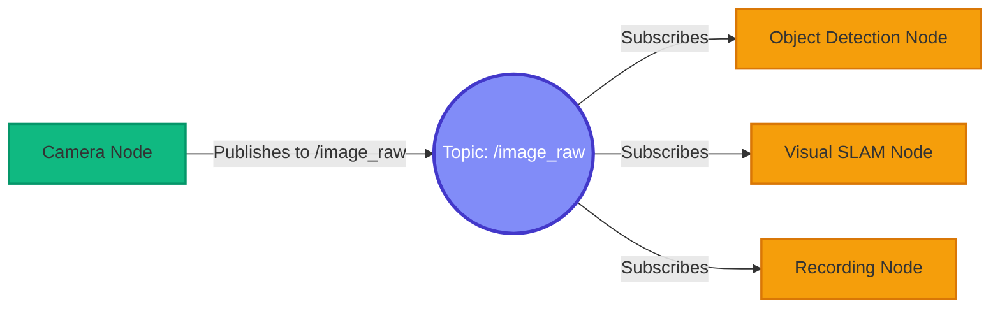
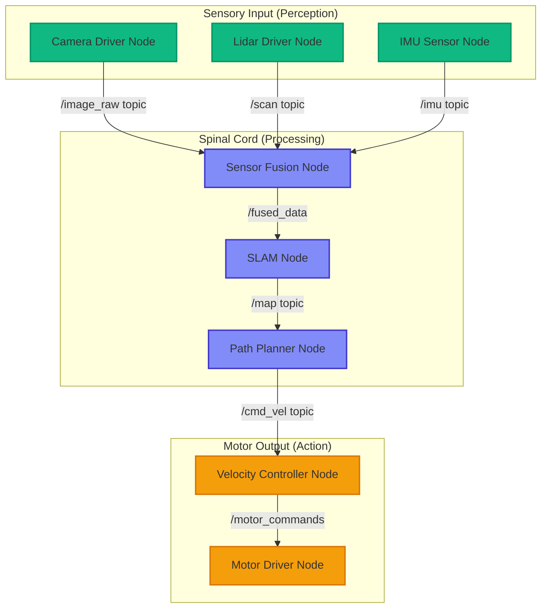

# Introduction to ROS 2: The Robot's Nervous System

## Why ROS 2?

In the rapidly evolving landscape of robotics and embodied AI, **ROS 2 (Robot Operating System 2)** has emerged as the de facto industry standard for building intelligent, autonomous systems. From Boston Dynamics' agile quadrupeds like Spot to NASA's Mars rovers, from Waymo's autonomous vehicles to Amazon's warehouse automation fleets, ROS 2 powers the world's most advanced robots.

But what exactly is ROS 2, and why has it become so ubiquitous?

At its core, **ROS 2 is not an operating system** in the traditional sense (like Linux or Windows). Rather, it is a **middleware framework** — a communication layer that sits between your robot's hardware and the intelligent software you write. It provides the essential infrastructure for:

- **Inter-process communication**: Enabling different programs (sensors, controllers, AI models) to talk to each other
- **Hardware abstraction**: Allowing you to write code that works across different sensors and actuators without vendor lock-in
- **Distributed computing**: Letting you run computations across multiple machines (workstation GPU + edge device CPU)
- **Tool ecosystem**: Providing visualization (RViz), simulation (Gazebo), and debugging utilities out of the box

Think of ROS 2 as the **connective tissue** that transforms a collection of disparate hardware components into a cohesive, intelligent system capable of autonomous decision-making.

---

## The Nervous System Analogy

To truly understand ROS 2's architecture, we'll use a powerful biological metaphor: **the human nervous system**. Just as your brain doesn't directly control every muscle fiber, ROS 2 doesn't monolithically manage every robot component. Instead, it orchestrates a network of specialized processors that communicate through well-defined pathways.

### Neurons → Nodes

In the human nervous system, **neurons** are the fundamental computational units. Each neuron has a specific function:
- Sensory neurons detect stimuli (light, pressure, temperature)
- Motor neurons trigger muscle contractions
- Interneurons process and relay information

Similarly, in ROS 2, **nodes** are the basic building blocks of any robot system. A node is a **single-purpose executable process** that performs one well-defined task:
- A camera driver node publishes image data
- A path planning node computes obstacle-free trajectories
- A motor controller node sends velocity commands to wheels

**Key characteristics of ROS 2 nodes**:
- **Independent execution**: Each node runs as a separate process, allowing parallel computation
- **Single responsibility**: One node, one job (e.g., read lidar data, not "read lidar AND plan path")
- **Unique naming**: Every node has a globally unique name (e.g., `/camera_driver`, `/nav_planner`)
- **Language agnostic**: Nodes can be written in Python, C++, or any language with ROS 2 client library support

### Nerve Pathways → Topics

When your hand touches a hot stove, sensory neurons send signals through **nerve pathways** (axons) to your brain. The brain processes this information and sends return signals through motor pathways to trigger muscle contractions, pulling your hand away. This is a **unidirectional, continuous data stream**.

In ROS 2, **topics** serve the exact same role. A topic is a **named communication channel** for streaming data:
- A lidar sensor node **publishes** distance measurements to the `/scan` topic
- A collision avoidance node **subscribes** to `/scan` and continuously receives lidar data
- Multiple nodes can subscribe to the same topic simultaneously (broadcast communication)



**Key characteristics of ROS 2 topics**:
- **Publish-Subscribe pattern**: Decoupled producers (publishers) and consumers (subscribers)
- **Asynchronous**: Publishers don't wait for subscribers to process data
- **Many-to-many**: One publisher can have multiple subscribers, and vice versa
- **Typed messages**: Each topic carries a specific message type (e.g., `sensor_msgs/Image`, `geometry_msgs/Twist`)

### Targeted Neural Signals → Services

While most neural communication is continuous (like breathing or heartbeat regulation), some interactions are **on-demand and require a response**. For example, when your brain needs to calculate how much force to apply to lift an object, it queries specific neural circuits and waits for the result before issuing motor commands.

ROS 2 **services** implement this request-response pattern:
- A navigation node **requests** inverse kinematics calculation from a computation service
- The service **processes** the request (calculates joint angles needed to reach a target position)
- The service **responds** with the result
- The navigation node receives the response and continues execution

**When to use services vs. topics**:

| Scenario | Use Topics (Pub/Sub) | Use Services (Request/Response) |
|----------|---------------------|--------------------------------|
| **Continuous sensor data** | ✅ Camera frames, lidar scans | ❌ Too much overhead |
| **One-time calculations** | ❌ No response mechanism | ✅ Inverse kinematics, path planning queries |
| **Motor control commands** | ✅ Velocity updates every 50ms | ❌ Commands are continuous |
| **Configuration queries** | ❌ No request-response | ✅ "Get current robot state" |
| **Emergency stop** | ✅ Broadcast to all nodes | ❌ Can't wait for responses |

---

## Visualizing the Node Graph

Let's see how a simple mobile robot's nervous system (ROS 2 architecture) might look:



This diagram shows:
- **Green nodes**: Sensory input (camera, lidar, IMU)
- **Blue nodes**: Processing and decision-making (sensor fusion, SLAM, path planning)
- **Orange nodes**: Motor output (velocity control, motor drivers)
- **Arrows**: Topics carrying typed messages between nodes

---

## The Brain-Body Bridge: How ROS 2 Connects AI to Hardware

One of the most powerful aspects of ROS 2 is its role as the **bridge between abstract AI algorithms and physical robot hardware**. Let's trace a complete perception-to-action pipeline:

### Example: Autonomous Navigation

1. **Perception (Sensors → ROS 2 Topics)**:
   - A **Realsense D435i camera** captures RGB-D images at 30 FPS
   - The camera driver node publishes these images to the `/camera/color/image_raw` topic
   - A **Velodyne lidar** scans the environment and publishes point clouds to `/scan`

2. **Cognition (AI "Brain" Processing)**:
   - A **Visual SLAM node** (e.g., ORB-SLAM3) subscribes to `/camera/color/image_raw`
   - It builds a 3D map of the environment and publishes it to `/map`
   - A **path planning node** (e.g., Nav2) subscribes to `/map` and computes a collision-free path
   - The planner publishes velocity commands to `/cmd_vel` (a `geometry_msgs/Twist` message)

3. **Action (Commands → Physical Motors)**:
   - A **motor controller node** subscribes to `/cmd_vel`
   - It translates high-level velocity commands (e.g., "move forward at 0.5 m/s") into low-level motor signals
   - The controller sends PWM signals to the robot's wheel motors via serial communication

**Without ROS 2**, you would need to write custom code to:
- Interface with each sensor's proprietary SDK (Realsense C++ API, Velodyne socket protocol)
- Manually synchronize data streams (camera frames arriving at 30 Hz, lidar at 10 Hz)
- Implement your own inter-process communication (shared memory, sockets, message queues)
- Handle node crashes and restarts

**With ROS 2**, all of this complexity is abstracted away. You simply:
- Publish sensor data to standardized topics
- Subscribe to the topics you need
- Let ROS 2 handle message serialization, network transport, and node lifecycle management

---

## ROS 2 vs. ROS 1: Why the Upgrade Matters

If you've heard of ROS before, you might be wondering: why ROS 2? The original ROS (ROS 1) was groundbreaking when it launched in 2007, but it had fundamental limitations:

| Limitation in ROS 1 | Solution in ROS 2 |
|---------------------|-------------------|
| **No real-time support** | DDS middleware with deterministic latency |
| **Single master node** (single point of failure) | **Distributed architecture** (no master required) |
| **No built-in security** | **Encrypted communication** (SROS2) |
| **Poor support for embedded systems** | **Optimized for resource-constrained devices** (Jetson, Raspberry Pi) |
| **Python 2 only** | **Python 3** and modern C++17 |
| **Limited Windows/macOS support** | **Cross-platform** (Linux, Windows, macOS) |

For modern robotics applications — especially those involving **real-time control**, **multi-robot systems**, or **edge AI deployment** — ROS 2 is the only viable choice.

---

## Getting Started: Your First ROS 2 Interaction

Before diving into code (which we'll do in the next section), let's verify your ROS 2 environment and explore the command-line tools:

### 1. Verify ROS 2 Installation

Open a terminal and run:

```bash
ros2 --version
```

You should see output like:
```
ros2 cli version: 0.18.5
```

### 2. List Running Nodes

Even without starting any nodes yourself, ROS 2 has some background processes. Check them with:

```bash
ros2 node list
```

If your system is idle, you might see:
```
/launch_ros
```

### 3. List Available Topics

See what topics exist (even if no nodes are publishing):

```bash
ros2 topic list
```

You'll see built-in topics like:
```
/parameter_events
/rosout
```

### 4. Inspect a Topic

Get detailed information about a topic:

```bash
ros2 topic info /rosout
```

Output:
```
Type: rcl_interfaces/msg/Log
Publisher count: 1
Subscription count: 0
```

---

## What's Next?

Now that you understand the **conceptual architecture** of ROS 2 through the nervous system analogy, you're ready to get hands-on. In the next section, **Nodes and Topics in Practice**, we'll:

- Write our first ROS 2 node in Python using `rclpy`
- Create a **Talker** node that publishes messages
- Create a **Listener** node that subscribes to those messages
- See real-time communication happening between nodes
- Learn debugging techniques with ROS 2 CLI tools

By the end of the next tutorial, you'll have running code that demonstrates the power of the publish-subscribe pattern — the foundation of all ROS 2 systems.

---

## Interactive Flashcards

import Flashcards from '@site/src/components/Flashcards';

<Flashcards
  title="ROS 2 Concepts Review"
  cards={[
    {
      id: 1,
      question: "What is ROS 2?",
      answer: "ROS 2 is a middleware framework (not an operating system) that provides communication infrastructure, hardware abstraction, distributed computing capabilities, and tools for building intelligent robot systems.",
      category: "Fundamentals"
    },
    {
      id: 2,
      question: "What is a ROS 2 Node?",
      answer: "A node is a single-purpose executable process that performs one well-defined task. Each node runs independently, has a unique name, and can be written in Python, C++, or other supported languages.",
      category: "Architecture"
    },
    {
      id: 3,
      question: "What is a ROS 2 Topic?",
      answer: "A topic is a named communication channel for streaming data using the publish-subscribe pattern. Publishers send data asynchronously, and multiple subscribers can receive the same data simultaneously.",
      category: "Communication"
    },
    {
      id: 4,
      question: "When should you use ROS 2 Services instead of Topics?",
      answer: "Use services for one-time calculations or configuration queries that require a response (request-response pattern). Use topics for continuous data streams like sensor readings or motor commands.",
      category: "Communication"
    },
    {
      id: 5,
      question: "What are the key advantages of ROS 2 over ROS 1?",
      answer: "ROS 2 offers real-time support with DDS middleware, distributed architecture (no master node), built-in security, better support for embedded systems, Python 3 support, and cross-platform compatibility.",
      category: "ROS 2 vs ROS 1"
    },
    {
      id: 6,
      question: "How does ROS 2 connect AI to hardware?",
      answer: "ROS 2 serves as a bridge between abstract AI algorithms (perception, planning) and physical hardware. Sensors publish data to topics, AI nodes process it and publish commands, and actuator nodes translate those commands into motor signals.",
      category: "Integration"
    }
  ]}
/>

---

## Key Takeaways

✅ **ROS 2 is middleware**, not an operating system — it provides communication infrastructure for robot software

✅ **Nodes are like neurons** — independent processes that each perform a single, well-defined task

✅ **Topics are like nerve pathways** — unidirectional data streams using the publish-subscribe pattern

✅ **Services are targeted requests** — synchronous request-response interactions for one-time calculations

✅ **The brain-body bridge** — ROS 2 connects high-level AI algorithms (the "brain") to low-level hardware (the "body")

✅ **ROS 2 > ROS 1** — Real-time support, distributed architecture, security, and Python 3 make it essential for modern robotics

---

**Ready to write code?** Continue to [**Nodes and Topics in Practice**](./02-nodes-and-topics.md) to build your first ROS 2 publisher and subscriber! 🚀
