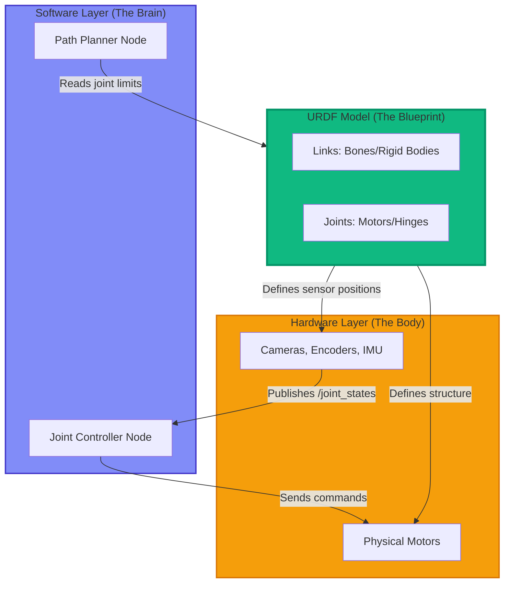

# URDF Modeling: Bridging the Brain and Body

In the previous sections, we explored the software nervous system (nodes and topics). Now we turn our attention to the **physical body** of the robot itself. How does ROS 2 understand the geometry, kinematics, and sensor placements of a robot? The answer is **URDF (Unified Robot Description Format)**.

---

## Why URDF? The Need for Robot Models

Imagine trying to control a robot arm to pick up an object. Your navigation algorithm needs to answer questions like:
- **Where is the camera mounted?** (to transform image coordinates to world coordinates)
- **How long is each arm segment?** (to calculate reachability)
- **What joints can move?** (to plan valid trajectories)
- **Where do collisions occur?** (to avoid hitting obstacles)

Without a standardized way to describe robot structure, every algorithm would need custom, hard-coded values. **URDF solves this** by providing a machine-readable XML format that answers all these questions in one place.

### What URDF Enables

✅ **Simulation**: Gazebo and Isaac Sim use URDF to render realistic robot models
✅ **Visualization**: RViz2 displays your robot's current joint states in 3D
✅ **Kinematics**: Motion planning libraries compute inverse kinematics using URDF chain definitions
✅ **Sensor Fusion**: Transform sensor data (camera, lidar) from local frames to a global map
✅ **Collision Detection**: Physics engines use URDF collision geometry to prevent self-collisions

---

## The Brain-Body Bridge: From Topics to Physical Hardware

Let's trace how URDF connects the ROS 2 software layer to physical robot components:



The URDF sits at the **interface** between software algorithms and physical hardware, providing a common language for both.

---

## URDF Basics: Links (The Bones)

In the biological analogy, **links** are the **bones** of your robot. A link is a **rigid body** — a solid piece that doesn't deform.

### Anatomy of a Link

Every link has three key properties:

1. **Visual Geometry**: How it looks (rendered in RViz and simulation)
2. **Collision Geometry**: Shape used for collision detection (often simplified for performance)
3. **Inertial Properties**: Mass, center of mass, moment of inertia (for physics simulation)

### Example: A Simple Cylinder Link

```xml
<link name="base_link">
  <!-- Visual representation (what you see in RViz) -->
  <visual>
    <geometry>
      <cylinder length="0.1" radius="0.05"/>
    </geometry>
    <origin xyz="0 0 0.05" rpy="0 0 0"/>
    <material name="blue">
      <color rgba="0 0 0.8 1"/>
    </material>
  </visual>

  <!-- Collision geometry (used for physics calculations) -->
  <collision>
    <geometry>
      <cylinder length="0.1" radius="0.05"/>
    </geometry>
    <origin xyz="0 0 0.05" rpy="0 0 0"/>
  </collision>

  <!-- Inertial properties (for dynamics simulation) -->
  <inertial>
    <mass value="1.0"/>
    <inertia ixx="0.001" ixy="0" ixz="0" iyy="0.001" iyz="0" izz="0.001"/>
  </inertial>
</link>
```

**Key elements**:
- `<geometry>`: Shape primitives (`<cylinder>`, `<box>`, `<sphere>`) or custom meshes (`.stl`, `.dae` files)
- `<origin>`: Position (`xyz`) and orientation (`rpy` = roll-pitch-yaw in radians) relative to link frame
- `<material>`: Visual appearance (color in RGBA format)

---

## URDF Basics: Joints (The Motors)

**Joints** are the **motors** or **hinges** that connect links together. They define how links can move relative to each other.

### Types of Joints

| Joint Type | Description | Degrees of Freedom | Example |
|------------|-------------|-------------------|---------|
| **revolute** | Hinge joint (rotates around an axis) | 1 (rotation) | Elbow, shoulder |
| **continuous** | Revolute with no limits (spins forever) | 1 (rotation) | Wheel axle |
| **prismatic** | Sliding joint (linear motion) | 1 (translation) | Elevator, telescope |
| **fixed** | No movement (rigidly attached) | 0 | Camera mount, sensor bracket |
| **floating** | Free movement in 3D space | 6 (3 translation + 3 rotation) | Drone, underwater robot |
| **planar** | Movement in a 2D plane | 3 (2 translation + 1 rotation) | Mobile robot on flat ground |

### Example: A Revolute Joint (Elbow)

```xml
<joint name="elbow_joint" type="revolute">
  <!-- Parent link (upper arm) -->
  <parent link="upper_arm_link"/>

  <!-- Child link (forearm) -->
  <child link="forearm_link"/>

  <!-- Joint position relative to parent link -->
  <origin xyz="0 0 0.3" rpy="0 0 0"/>

  <!-- Rotation axis (0 1 0 means rotate around Y-axis) -->
  <axis xyz="0 1 0"/>

  <!-- Joint limits -->
  <limit lower="-1.57" upper="1.57" effort="10" velocity="1"/>
</joint>
```

**Key elements**:
- `<parent>` and `<child>`: Defines which links are connected
- `<origin>`: Where the joint is located (in parent link's coordinate frame)
- `<axis>`: Direction of rotation (unit vector)
- `<limit>`:
  - `lower`/`upper`: Min/max joint angles (radians)
  - `effort`: Maximum torque (Newton-meters)
  - `velocity`: Maximum angular speed (radians/second)

---

## Complete Example: 2-Link Robot Arm

Let's build a simple robot arm with two links (upper arm, forearm) and two revolute joints (shoulder, elbow).

### The Full URDF

Save this as `simple_arm.urdf`:

```xml
<?xml version="1.0"?>
<robot name="simple_arm">

  <!-- ========================================= -->
  <!-- BASE LINK (Fixed to the world) -->
  <!-- ========================================= -->
  <link name="base_link">
    <visual>
      <geometry>
        <cylinder length="0.1" radius="0.05"/>
      </geometry>
      <origin xyz="0 0 0.05" rpy="0 0 0"/>
      <material name="blue">
        <color rgba="0 0 0.8 1"/>
      </material>
    </visual>
    <collision>
      <geometry>
        <cylinder length="0.1" radius="0.05"/>
      </geometry>
      <origin xyz="0 0 0.05" rpy="0 0 0"/>
    </collision>
    <inertial>
      <mass value="1.0"/>
      <inertia ixx="0.001" ixy="0" ixz="0" iyy="0.001" iyz="0" izz="0.001"/>
    </inertial>
  </link>

  <!-- ========================================= -->
  <!-- LINK 1 (Upper Arm) -->
  <!-- ========================================= -->
  <link name="link1">
    <visual>
      <geometry>
        <!-- Box: upper arm (5cm x 5cm x 30cm) -->
        <box size="0.05 0.05 0.3"/>
      </geometry>
      <!-- Center the box at 15cm above joint (half of 30cm height) -->
      <origin xyz="0 0 0.15" rpy="0 0 0"/>
      <material name="red">
        <color rgba="0.8 0 0 1"/>
      </material>
    </visual>
    <collision>
      <geometry>
        <box size="0.05 0.05 0.3"/>
      </geometry>
      <origin xyz="0 0 0.15" rpy="0 0 0"/>
    </collision>
    <inertial>
      <mass value="0.5"/>
      <inertia ixx="0.004" ixy="0" ixz="0" iyy="0.004" iyz="0" izz="0.0001"/>
    </inertial>
  </link>

  <!-- ========================================= -->
  <!-- JOINT 1 (Shoulder - connects base to link1) -->
  <!-- ========================================= -->
  <joint name="joint1" type="revolute">
    <parent link="base_link"/>
    <child link="link1"/>
    <!-- Joint is 10cm above base_link origin -->
    <origin xyz="0 0 0.1" rpy="0 0 0"/>
    <!-- Rotates around Y-axis (side-to-side motion) -->
    <axis xyz="0 1 0"/>
    <!-- Joint limits: -90° to +90° (in radians) -->
    <limit lower="-1.57" upper="1.57" effort="10" velocity="1"/>
  </joint>

  <!-- ========================================= -->
  <!-- LINK 2 (Forearm) -->
  <!-- ========================================= -->
  <link name="link2">
    <visual>
      <geometry>
        <!-- Slightly smaller box: 4cm x 4cm x 25cm -->
        <box size="0.04 0.04 0.25"/>
      </geometry>
      <!-- Center at 12.5cm above joint -->
      <origin xyz="0 0 0.125" rpy="0 0 0"/>
      <material name="green">
        <color rgba="0 0.8 0 1"/>
      </material>
    </visual>
    <collision>
      <geometry>
        <box size="0.04 0.04 0.25"/>
      </geometry>
      <origin xyz="0 0 0.125" rpy="0 0 0"/>
    </collision>
    <inertial>
      <mass value="0.3"/>
      <inertia ixx="0.002" ixy="0" ixz="0" iyy="0.002" iyz="0" izz="0.0001"/>
    </inertial>
  </link>

  <!-- ========================================= -->
  <!-- JOINT 2 (Elbow - connects link1 to link2) -->
  <!-- ========================================= -->
  <joint name="joint2" type="revolute">
    <parent link="link1"/>
    <child link="link2"/>
    <!-- Joint is at the top of link1 (30cm above link1 origin) -->
    <origin xyz="0 0 0.3" rpy="0 0 0"/>
    <!-- Also rotates around Y-axis -->
    <axis xyz="0 1 0"/>
    <!-- Joint limits: -90° to +90° -->
    <limit lower="-1.57" upper="1.57" effort="10" velocity="1"/>
  </joint>

</robot>
```

---

### Understanding the Structure

Let's visualize the kinematic chain:

```
Base Link (blue cylinder)
    ↓ [Joint 1: Shoulder at (0, 0, 0.1)]
Link 1 (red box, 30cm tall)
    ↓ [Joint 2: Elbow at (0, 0, 0.3) relative to Link 1]
Link 2 (green box, 25cm tall)
```

**Total height when straight**: 0.1m (base) + 0.3m (link1) + 0.25m (link2) = **0.65 meters (65cm)**

---

## Visualizing in RViz2

Now let's see our robot arm in 3D!

### Step 1: Install RViz2 (if not already installed)

```bash
sudo apt install ros-humble-rviz2
```

### Step 2: Launch Robot State Publisher

The `robot_state_publisher` node reads the URDF and publishes the robot's structure as TF (Transform) frames.

```bash
ros2 run robot_state_publisher robot_state_publisher --ros-args -p robot_description:="$(cat simple_arm.urdf)"
```

**What this does**:
- Reads `simple_arm.urdf`
- Publishes TF transforms for each link
- Makes the robot structure available to RViz

### Step 3: Open RViz2

In a new terminal:

```bash
rviz2
```

### Step 4: Configure RViz

1. **Set Fixed Frame**:
   - In the left panel, find "Fixed Frame"
   - Change from `map` to `base_link`

2. **Add RobotModel Display**:
   - Click "Add" button at bottom left
   - Select "RobotModel"
   - Click "OK"

3. **Add TF Display** (to see coordinate frames):
   - Click "Add" again
   - Select "TF"
   - Click "OK"

You should now see:
- A **blue cylinder** (base_link)
- A **red box** (link1) extending upward
- A **green box** (link2) extending from the top of link1
- **Colored axes** at each joint (TF frames)

🎉 **Success!** You're now visualizing a robot model defined in URDF.

---

## Coordinate Frames and the TF Tree

Every link in URDF creates a **coordinate frame** (also called a TF frame). These frames form a tree structure:

```
base_link (root)
    └─ link1 (child via joint1)
        └─ link2 (child via joint2)
```

### Understanding Transforms

Each joint defines a **transform** from parent to child:
- **Translation**: `<origin xyz="0 0 0.3"/>` means "child is 30cm above parent in Z-axis"
- **Rotation**: `rpy="0 0 0"` means "no rotation" (rpy = roll, pitch, yaw)

ROS 2's **TF2 library** uses this tree to answer questions like:
- "What is the position of link2's tip relative to base_link?" (forward kinematics)
- "If my camera is on link2, where is an object in the world frame?"

### Querying Transforms

You can query transforms from the command line:

```bash
ros2 run tf2_ros tf2_echo base_link link2
```

**Output**:
```
At time 0.0
- Translation: [0.000, 0.000, 0.650]
- Rotation: in Quaternion [0.000, 0.000, 0.000, 1.000]
```

This tells you that when joints are at zero position, link2 is 65cm above base_link (exactly as we calculated!).

---

## Common URDF Patterns

### Pattern 1: Sensor Mounting (Fixed Joint)

To attach a camera to link2:

```xml
<link name="camera_link">
  <visual>
    <geometry>
      <box size="0.02 0.05 0.02"/>
    </geometry>
    <material name="black">
      <color rgba="0 0 0 1"/>
    </material>
  </visual>
</link>

<joint name="camera_joint" type="fixed">
  <parent link="link2"/>
  <child link="camera_link"/>
  <!-- Camera is 25cm above link2 base, facing forward -->
  <origin xyz="0 0.03 0.25" rpy="0 0 0"/>
</joint>
```

Now when link2 moves, the camera moves with it!

### Pattern 2: Mesh Files (Custom Geometry)

Instead of primitive shapes, use 3D models:

```xml
<visual>
  <geometry>
    <mesh filename="package://my_robot/meshes/arm_link.stl" scale="1 1 1"/>
  </geometry>
</visual>
```

**Note**: `package://` refers to a ROS 2 package. For now, use primitive shapes (box, cylinder, sphere).

---

## Project: Extend the Arm with a Wrist Joint

**Challenge**: Add a 3rd link ("wrist") and 3rd joint to the robot arm.

### Requirements

- Link name: `link3`
- Joint name: `joint3` (type: `revolute`)
- Link dimensions: 3cm x 3cm x 15cm (box)
- Joint limits: -1.0 to 1.0 radians
- Color: Yellow (`rgba="1 1 0 1"`)

**Hints**:
1. Copy the `link2` block and modify it
2. Add `joint3` connecting `link2` (parent) to `link3` (child)
3. Set the joint origin to `xyz="0 0 0.25"` (top of link2)

<details>
<summary>Click to reveal solution</summary>

```xml
<!-- Add this before the closing </robot> tag -->

<!-- LINK 3 (Wrist) -->
<link name="link3">
  <visual>
    <geometry>
      <box size="0.03 0.03 0.15"/>
    </geometry>
    <origin xyz="0 0 0.075" rpy="0 0 0"/>
    <material name="yellow">
      <color rgba="1 1 0 1"/>
    </material>
  </visual>
  <collision>
    <geometry>
      <box size="0.03 0.03 0.15"/>
    </geometry>
    <origin xyz="0 0 0.075" rpy="0 0 0"/>
  </collision>
  <inertial>
    <mass value="0.1"/>
    <inertia ixx="0.0002" ixy="0" ixz="0" iyy="0.0002" iyz="0" izz="0.00001"/>
  </inertial>
</link>

<!-- JOINT 3 (Wrist) -->
<joint name="joint3" type="revolute">
  <parent link="link2"/>
  <child link="link3"/>
  <origin xyz="0 0 0.25" rpy="0 0 0"/>
  <axis xyz="0 1 0"/>
  <limit lower="-1.0" upper="1.0" effort="5" velocity="1"/>
</joint>
```

**New total height**: 0.1 + 0.3 + 0.25 + 0.15 = **0.8 meters (80cm)**

</details>

---

## Real-World Context: From URDF to SLAM

You might wonder: "Why do I need to learn URDF for AI robotics?"

In **Module 3 (Visual SLAM and Navigation)**, you'll use URDF files to:
- Define where cameras and lidars are mounted on the robot
- Transform sensor data from local frames to a global map
- Compute collision-free paths that respect the robot's physical dimensions
- Visualize the robot's planned trajectory in RViz before execution

Without URDF, your SLAM algorithm wouldn't know where the camera is relative to the wheels, making it impossible to build an accurate map!

---

## Summary and Next Steps

Congratulations! You've completed Module 1: The Robotic Nervous System. Let's recap what you've learned:

### Module 1 Recap

**Part 1: Introduction to ROS 2**
- ✅ ROS 2 is middleware, not an OS
- ✅ Nodes are neurons, topics are nerve pathways, services are targeted signals
- ✅ ROS 2 bridges AI software (brain) to robot hardware (body)

**Part 2: Nodes and Topics in Practice**
- ✅ Wrote a Publisher node in Python using `rclpy`
- ✅ Wrote a Subscriber node that receives messages
- ✅ Used ROS 2 CLI tools to inspect and debug running systems

**Part 3: URDF Modeling**
- ✅ Understood links (bones) and joints (motors)
- ✅ Created a complete 2-link robot arm URDF
- ✅ Visualized the robot in RViz2
- ✅ Learned about coordinate frames and TF trees

---

### Progression to Module 2: The Digital Twin

Now that you understand how robots communicate (nodes/topics) and how they're structured (URDF), you're ready for **simulation**. In Module 2, we'll:

- Launch Gazebo and simulate the robot arm we just modeled
- Add sensors (cameras, lidar) to the URDF and receive simulated data
- Implement sensor fusion to combine data from multiple sources
- Use Unity for photorealistic rendering
- Learn how to test algorithms in simulation before deploying to real hardware

**Ready to simulate?** Continue to **[Module 2: The Digital Twin - Simulation and Sensors](../02-digital-twin/01-intro.md)** 🚀

---

## Key Takeaways

✅ **URDF** (Unified Robot Description Format) is an XML-based language for describing robot structure

✅ **Links** are rigid bodies (bones) with visual, collision, and inertial properties

✅ **Joints** define how links move relative to each other (revolute, prismatic, fixed, etc.)

✅ **Coordinate frames** (TF) allow ROS 2 to transform data between different parts of the robot

✅ **RViz2** visualizes URDF models and TF trees in real-time

✅ **robot_state_publisher** broadcasts TF transforms based on URDF and joint states

✅ **Primitive shapes** (`<box>`, `<cylinder>`, `<sphere>`) are easier than meshes for learning

---

**Download URDF**:
- [simple_arm.urdf](./assets/simple_arm.urdf)
- [simple_arm_with_wrist.urdf](./assets/simple_arm_with_wrist.urdf) (solution to project)
