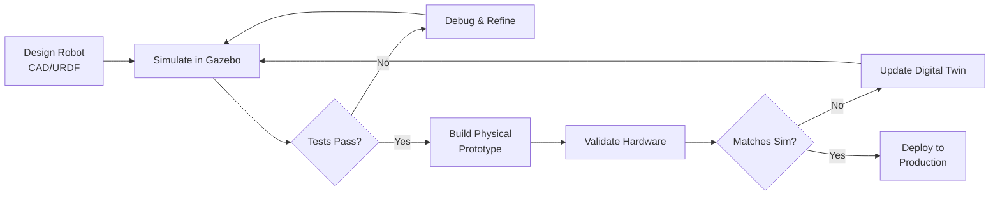

# The Digital Twin

## What is a Digital Twin?

A **digital twin** is a virtual clone of your physical robot that exists entirely in software. Think of it like a flight simulator for pilots — before you risk crashing a $3,000+ robot, you crash it 100 times in simulation to perfect your algorithms.

In robotics, the digital twin serves as your **safe testing ground** where you can:
- 🧪 **Test dangerous scenarios** without physical risk (falling off edges, high-speed collisions)
- 🔄 **Iterate rapidly** — No need to charge batteries, replace broken parts, or reset physical hardware
- 📊 **Collect perfect data** — Sensors never have noise (unless you add it intentionally for realism)
- 💰 **Save money** — Develop algorithms before purchasing expensive sensors like LiDAR ($1,500+)

### Real-World Examples

- **Boston Dynamics**: Spot was tested over **100,000 times** in simulation before its first physical test
- **NASA**: Mars rovers are validated in digital twin environments on Earth before launch
- **Waymo**: Autonomous vehicles are tested for **billions of miles** in simulation before real-world deployment

---

## The Sim-to-Real Workflow



This iterative cycle ensures that when you finally power on your physical robot, the control algorithms have already been battle-tested thousands of times in the virtual world.

---

## Why Simulation Isn't Cheating

Some engineers initially resist simulation, thinking "real hardware is what matters." But consider:

- **Airbus A380**: Before its first flight, the aircraft was tested in simulation over **50,000 times**
- **SpaceX Falcon 9**: Landing algorithms were perfected in simulation before the first successful drone ship landing
- **Formula 1 Racing**: Teams run millions of race laps in simulators before track testing

**The rule**: If aerospace and motorsports — industries where mistakes cost millions — rely on simulation, robotics should too.

---

## Hardware Requirements

:::danger High-Performance GPU Required

**You need an NVIDIA RTX 4070 Ti (12GB VRAM) or higher** to run Isaac Sim and Gazebo with high-fidelity sensors.

**Why?** Realistic sensor simulation (LiDAR, depth cameras) requires **GPU ray tracing** to calculate light/laser reflections in real-time. Without an RTX GPU:
- **LiDAR simulation**: 2 FPS (unusable) vs. 300 FPS (RTX 4070 Ti)
- **Depth camera**: 1 FPS (unusable) vs. 200 FPS (RTX 4070 Ti)

**Minimum**: NVIDIA RTX 4060 (8GB VRAM) — $300
**Recommended**: NVIDIA RTX 4070 Ti (12GB VRAM) — $800

If you don't have an RTX GPU yet, you can still learn the concepts in this module, but sensor simulation will not be performant.

:::

### System Requirements

```yaml
Operating System: Ubuntu 22.04 LTS
RAM: 16 GB minimum (32 GB recommended)
GPU: NVIDIA RTX 4060 or better (REQUIRED for sensor simulation)
Storage: 50 GB free (for Gazebo worlds, Unity projects, and robot meshes)
Software: ROS 2 Humble, Gazebo Fortress, NVIDIA Driver 525+
```

**Budget Alternatives** (for students):
- Used RTX 3060 (~$200) — Adequate for learning
- AWS EC2 g5.xlarge (~$1/hour) — Rent RTX A10G in the cloud
- University Labs — Many robotics labs have RTX workstations

---

## What's Next in This Module?

In the following tutorials, you'll:

1. **[Physics with Gazebo Fortress](./02-gazebo-fortress-setup.md)** — Install Gazebo, create your first world with gravity and collisions
2. **[Adding Eyes & Ears (Sensors)](./03-simulating-sensors.md)** — Add LiDAR and depth cameras to your robot with GPU ray tracing
3. **[High-Fidelity Rendering in Unity](./04-unity-visualization.md)** — Use Unity for photorealistic visualization and synthetic data generation

Before proceeding, verify your GPU is ready:

```bash
nvidia-smi
# Should show: NVIDIA RTX 4060 or better, Driver 525+
```

If the command fails, revisit **Module 0: Hardware Setup** to install NVIDIA drivers.

---

## Key Takeaways

✅ **Digital twins** are virtual clones of physical robots used for safe, rapid testing

✅ **Simulation-first development** is industry standard (Boston Dynamics, NASA, Waymo)

✅ **NVIDIA RTX GPU required** for realistic sensor simulation (ray tracing acceleration)

✅ **This module teaches** Gazebo (physics simulation) and Unity (visual rendering)

---

**Ready to build your first digital twin?** Continue to [**Physics with Gazebo Fortress**](./02-gazebo-fortress-setup.md) to create simulation worlds! 🚀
