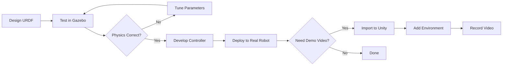

# High-Fidelity Rendering in Unity

## Why Unity When We Have Gazebo?

**Gazebo Fortress** is excellent for **physics simulation** and sensor testing, but it has limitations when you need:

- 🎨 **Photorealistic rendering** for presentations, demos, or marketing materials
- 👤 **Human-robot interaction (HRI)** — Simulating people walking around robots
- 🌍 **Complex environments** — Detailed indoor scenes (furniture, lighting, reflections)
- 📹 **Cinematic camera control** — Smooth camera movements for video production
- 🧠 **Synthetic data generation** — Training computer vision models with perfect labels

### When to Use Each

| Use Case | Gazebo Fortress | Unity |
|----------|----------------|-------|
| **Physics testing** | ✅ Best choice (accurate ODE/Bullet physics) | ⚠️ Okay (PhysX, less tuned for robotics) |
| **Sensor simulation** | ✅ Best choice (GPU ray tracing, ROS 2 native) | ⚠️ Okay (requires custom scripts) |
| **Control algorithm development** | ✅ Best choice (1ms time step, deterministic) | ❌ Not recommended (variable time step) |
| **Photorealistic visualization** | ❌ Limited (basic shaders) | ✅ Best choice (HDRP, ray tracing) |
| **Human-robot interaction** | ❌ No built-in humanoid AI | ✅ Best choice (NavMesh, crowd simulation) |
| **Synthetic dataset generation** | ⚠️ Okay (basic labels) | ✅ Best choice (perfect segmentation masks) |

**Best Practice**: Develop and test your robot in **Gazebo**, then import it into **Unity** for visualization, demos, or dataset generation.

---

## The Unity Robotics Hub

**Unity Robotics Hub** is Unity's official ROS integration package. It provides:

1. **ROS-TCP-Connector** — Bidirectional communication between Unity and ROS 2 via TCP (port 10000)
2. **URDF Importer** — Import your robot's URDF file directly into Unity scenes
3. **Articulation Body** — Unity's physics component for robotic joints (revolute, prismatic)
4. **Visualization Tools** — Subscribe to ROS 2 topics (`/joint_states`, `/tf`, `/camera/image_raw`)

### Architecture

```
ROS 2 Node (Ubuntu)          Unity Scene (Windows/Mac/Linux)
┌──────────────────┐         ┌──────────────────────┐
│  /joint_states   │────TCP──→│ Articulation Body   │
│  Publisher       │ Port     │ (Robot Model)        │
│                  │ 10000    │                      │
│  /cmd_vel        │←───TCP───│ C# Subscriber        │
│  Subscriber      │          │ (User Input)         │
└──────────────────┘         └──────────────────────┘
```

Unlike `ros_gz_bridge` (which uses DDS), Unity uses **TCP sockets** for cross-platform compatibility (Unity can run on Windows, where ROS 2 DDS has limitations).

---

## Installation

### Step 1: Install Unity Hub and Unity Editor

**Unity Hub** is the launcher that manages Unity versions.

```bash
# Download Unity Hub (Linux)
wget https://public-cdn.cloud.unity3d.com/hub/prod/UnityHubSetup.AppImage
chmod +x UnityHubSetup.AppImage
./UnityHubSetup.AppImage
```

**Windows/Mac**: Download Unity Hub from [https://unity.com/download](https://unity.com/download)

Once Unity Hub is installed:

1. Open Unity Hub
2. Click **"Installs"** → **"Install Editor"**
3. Select **Unity 2021.3 LTS** (Long-Term Support, stable for robotics)
4. Add modules:
   - ✅ Linux Build Support (if on Ubuntu)
   - ✅ Windows Build Support (if on Windows)

**Why 2021.3 LTS?** Unity Robotics Hub is tested with this version. Newer versions (2022+) may have compatibility issues.

---

### Step 2: Install ROS-TCP-Endpoint (ROS 2 Side)

This is the **server** that runs on your ROS 2 machine and listens for Unity connections.

```bash
# Navigate to your ROS 2 workspace
cd ~/ros2_ws/src

# Clone the ROS-TCP-Endpoint package
git clone https://github.com/Unity-Technologies/ROS-TCP-Endpoint.git

# Build the workspace
cd ~/ros2_ws
colcon build --packages-select ros_tcp_endpoint

# Source the workspace
source install/setup.bash
```

**Launch the endpoint**:

```bash
ros2 run ros_tcp_endpoint default_server_endpoint --ros-args -p ROS_IP:=0.0.0.0
```

**Expected Output**:
```
[INFO] [ros_tcp_endpoint]: ROS-TCP Endpoint listening on 0.0.0.0:10000
```

This server now waits for Unity to connect.

---

### Step 3: Create Unity Project and Import Robotics Hub

1. Open Unity Hub → **"New Project"**
2. Select **3D (URP)** template (Universal Render Pipeline for better graphics)
3. Project Name: `RobotVisualization`
4. Click **"Create Project"**

**Import Unity Robotics Hub**:

1. In Unity Editor, go to **Window → Package Manager**
2. Click **"+"** → **"Add package from git URL"**
3. Enter: `https://github.com/Unity-Technologies/ROS-TCP-Connector.git?path=/com.unity.robotics.ros-tcp-connector`
4. Click **"Add"**
5. Repeat for URDF Importer: `https://github.com/Unity-Technologies/URDF-Importer.git?path=/com.unity.robotics.urdf-importer`

**Verify installation**:
- Go to **Robotics → ROS Settings**
- You should see a "ROS IP Address" field

---

### Step 4: Configure ROS Connection

1. In Unity, go to **Robotics → ROS Settings**
2. Set **Protocol**: `ROS2`
3. Set **ROS IP Address**: `127.0.0.1` (if Unity and ROS 2 are on same machine)
   - If on different machines: Use the IP of your Ubuntu machine (e.g., `192.168.1.100`)
4. Set **ROS Port**: `10000`
5. Click **"Connect"**

**Expected**: Green indicator showing "Connected to ROS"

---

## Importing Your Robot URDF

Let's import the robot from Module 1 into Unity.

### Step 1: Copy URDF and Meshes

```bash
# Copy your robot's URDF and meshes to a Unity-accessible location
cp -r ~/ros2_ws/src/my_robot_description/urdf ~/Desktop/robot_urdf
cp -r ~/ros2_ws/src/my_robot_description/meshes ~/Desktop/robot_urdf/
```

### Step 2: Import in Unity

1. In Unity, go to **Assets → Import Robot from URDF**
2. Click **"Browse"** → Select your robot's URDF file
3. Import Settings:
   - ✅ **Import Meshes**
   - ✅ **Create Articulation Body** (for physics)
   - ✅ **Generate Unique Names**
4. Click **"Import"**

**Result**: Your robot appears in the Unity Scene view with all links and joints intact!

---

## Visualizing Joint States from ROS 2

Let's create a C# script to subscribe to `/joint_states` and move the robot in Unity.

### Create `JointStateSubscriber.cs`

```csharp
using UnityEngine;
using Unity.Robotics.ROSTCPConnector;
using RosMessageTypes.Sensor;

public class JointStateSubscriber : MonoBehaviour
{
    private ArticulationBody[] articulationChain;

    void Start()
    {
        // Get all articulation bodies in the robot
        articulationChain = GetComponentsInChildren<ArticulationBody>();

        // Subscribe to /joint_states topic
        ROSConnection.GetOrCreateInstance().Subscribe<JointStateMsg>(
            "/joint_states", UpdateJointStates);
    }

    void UpdateJointStates(JointStateMsg jointState)
    {
        // Match joint names to articulation bodies
        for (int i = 0; i < jointState.name.Length; i++)
        {
            string jointName = jointState.name[i];
            float position = (float)jointState.position[i];

            // Find matching articulation body
            foreach (var joint in articulationChain)
            {
                if (joint.name == jointName && joint.jointType != ArticulationJointType.FixedJoint)
                {
                    // Set joint target position (radians to degrees)
                    var drive = joint.xDrive;
                    drive.target = position * Mathf.Rad2Deg;
                    joint.xDrive = drive;
                }
            }
        }
    }
}
```

### Attach Script to Robot

1. In Unity Hierarchy, select your robot's **root object**
2. In Inspector, click **"Add Component"** → Search for `JointStateSubscriber`
3. Click **"Play"** in Unity Editor

**Test**:

```bash
# In ROS 2 terminal, publish joint states
ros2 topic pub /joint_states sensor_msgs/JointState "{name: ['wheel_left_joint', 'wheel_right_joint'], position: [1.5, 1.5]}"
```

**Result**: The robot's wheels rotate in Unity in real-time! 🎉

---

## Adding Photorealistic Environment

Unity's strength is **visual fidelity**. Let's add a realistic environment.

### Add HDRP (High Definition Render Pipeline)

1. **Window → Package Manager** → Search for **"High Definition RP"**
2. Click **"Install"**
3. **Edit → Render Pipeline → HD Render Pipeline → Wizard**
4. Click **"Fix All"** to upgrade materials

### Add Environment Assets

1. **Window → Asset Store**
2. Search for **"Modern Office Interior"** (free asset)
3. Click **"Download"** → **"Import"**
4. Drag the office prefab into your scene
5. Position your robot inside the office

**Result**: Your robot now exists in a photorealistic office environment with real-time reflections, shadows, and ambient occlusion — perfect for demos!

---

## Unity vs Gazebo: The Workflow

### Recommended Workflow



**Rule of Thumb**:
- **Gazebo**: For development (80% of your time)
- **Unity**: For presentation (20% of your time)

---

## Performance Requirements

Unlike Gazebo (which requires NVIDIA RTX for sensor simulation), Unity is **less GPU-intensive** for basic visualization:

- **Minimum**: Intel UHD Graphics (integrated GPU) — 30 FPS with basic materials
- **Recommended**: NVIDIA GTX 1660 or better — 60 FPS with HDRP
- **Optimal**: NVIDIA RTX 4060 or better — 120+ FPS with ray tracing

**Why the difference?** Unity's rendering is optimized for gaming (billions of dollars in R&D), while Gazebo prioritizes physics accuracy over visual performance.

---

## Common Issues

### Unity can't connect to ROS 2

**Debug**:

```bash
# Check if ROS-TCP-Endpoint is running
ros2 node list | grep tcp

# Check firewall (Linux)
sudo ufw allow 10000/tcp
```

**Fix**: Verify IP address in Unity ROS Settings matches your Ubuntu machine's IP (use `ip addr` to find it).

### Robot appears but doesn't move

**Debug**: Check if `/joint_states` topic is publishing:

```bash
ros2 topic echo /joint_states
```

**Fix**: Ensure your ROS 2 node publishes to `/joint_states` and that Unity's C# script matches joint names exactly (case-sensitive!).

### Meshes not loading

**Fix**: Ensure mesh files (`.dae`, `.stl`) are in the same directory as the URDF or use absolute paths in URDF `<mesh filename="...">` tags.

---

## Key Takeaways

✅ **Unity is for visualization**, Gazebo is for physics testing

✅ **Unity Robotics Hub** provides ROS 2 integration via TCP (port 10000)

✅ **URDF Importer** lets you reuse your Gazebo robot models in Unity

✅ **Install Unity 2021.3 LTS** (most stable for robotics)

✅ **C# scripts** subscribe to ROS 2 topics and control Unity GameObjects

✅ **HDRP** enables photorealistic rendering for demos and marketing

✅ **Less GPU-intensive** than Gazebo sensor simulation (GTX 1660 is enough)

---

**Next**: Now that you've mastered digital twins, it's time to make your robot **intelligent** with sensor processing and perception algorithms in **Module 3: Sensory Processing**! 🧠
