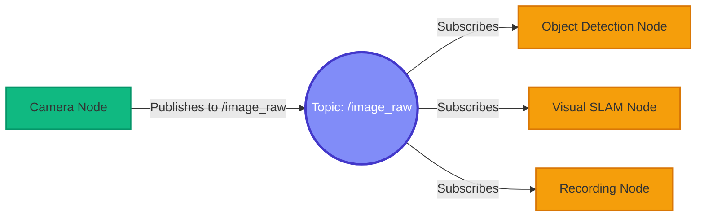
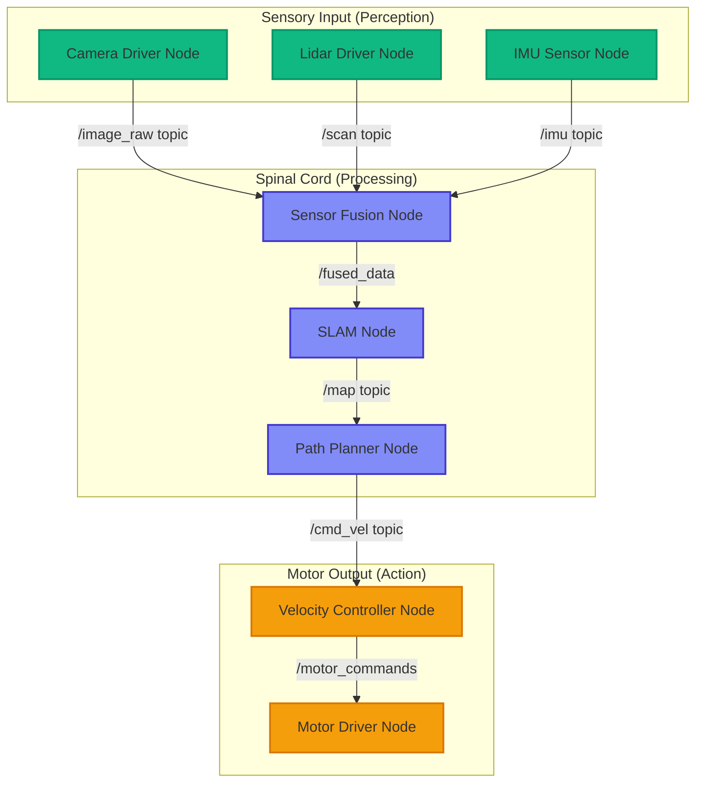

# ROS 2 کا تعارف: روبوٹ کا اعصابی نظام

## ROS 2 کیوں؟

روبوٹکس اور embodied AI کے تیزی سے ترقی کرتے منظر میں، **ROS 2 (Robot Operating System 2)** ذہین، خودمختار نظاموں کی تعمیر کے لیے صنعتی معیار کے طور پر ابھرا ہے۔ Boston Dynamics کے چست quadrupeds جیسے Spot سے لے کر NASA کے مریخ rovers تک، Waymo کی خودکار گاڑیوں سے لے کر Amazon کے warehouse automation fleets تک، ROS 2 دنیا کے سب سے جدید robots کو طاقت دیتا ہے۔

لیکن ROS 2 اصل میں کیا ہے، اور یہ اتنا عام کیوں ہو گیا ہے؟

اپنی بنیاد میں، **ROS 2 ایک operating system نہیں ہے** روایتی معنوں میں (جیسے Linux یا Windows)۔ بلکہ، یہ ایک **middleware framework** ہے — ایک communication layer جو آپ کے روبوٹ کے hardware اور ذہین software جو آپ لکھتے ہیں کے درمیان بیٹھتی ہے۔ یہ ضروری infrastructure فراہم کرتا ہے:

- **Inter-process communication**: مختلف programs (sensors، controllers، AI models) کو ایک دوسرے سے بات کرنے میں مدد کرنا
- **Hardware abstraction**: آپ کو ایسا code لکھنے کی اجازت دینا جو مختلف sensors اور actuators پر کام کرے بغیر vendor lock-in کے
- **Distributed computing**: آپ کو متعدد machines پر computations چلانے دینا (workstation GPU + edge device CPU)
- **Tool ecosystem**: visualization (RViz)، simulation (Gazebo)، اور debugging utilities box سے باہر فراہم کرنا

ROS 2 کو **connective tissue** کے طور پر سوچیں جو الگ الگ hardware components کے مجموعے کو ایک مربوط، ذہین نظام میں تبدیل کرتا ہے جو خودمختار فیصلہ سازی کی صلاحیت رکھتا ہے۔

---

## اعصابی نظام کی تشبیہ

ROS 2 کی architecture کو واقعی سمجھنے کے لیے، ہم ایک طاقتور حیاتیاتی استعارہ استعمال کریں گے: **انسانی اعصابی نظام**۔ جس طرح آپ کا دماغ براہ راست ہر muscle fiber کو control نہیں کرتا، ROS 2 monolithically ہر روبوٹ component کا انتظام نہیں کرتا۔ اس کے بجائے، یہ مخصوص processors کے نیٹ ورک کو ہم آہنگ کرتا ہے جو اچھی طرح سے متعین راستوں کے ذریعے communicate کرتے ہیں۔

### Neurons → Nodes

انسانی اعصابی نظام میں، **neurons** بنیادی computational units ہیں۔ ہر neuron کا ایک مخصوص کام ہوتا ہے:
- Sensory neurons stimuli کا پتہ لگاتے ہیں (روشنی، دباؤ، درجہ حرارت)
- Motor neurons muscle contractions کو trigger کرتے ہیں
- Interneurons معلومات پر کارروائی کرتے اور relay کرتے ہیں

اسی طرح، ROS 2 میں، **nodes** کسی بھی روبوٹ نظام کے بنیادی building blocks ہیں۔ ایک node ایک **single-purpose executable process** ہے جو ایک اچھی طرح سے متعین task انجام دیتا ہے:
- ایک camera driver node image data publish کرتا ہے
- ایک path planning node obstacle-free trajectories کا حساب لگاتا ہے
- ایک motor controller node پہیوں کو velocity commands بھیجتا ہے

**ROS 2 nodes کی اہم خصوصیات**:
- **Independent execution**: ہر node ایک الگ process کے طور پر چلتا ہے، parallel computation کی اجازت دیتا ہے
- **Single responsibility**: ایک node، ایک کام (مثلاً، lidar data پڑھیں، نہ کہ "lidar پڑھیں اور path plan کریں")
- **Unique naming**: ہر node کا globally unique نام ہوتا ہے (مثلاً، `/camera_driver`، `/nav_planner`)
- **Language agnostic**: Nodes Python، C++، یا ROS 2 client library support والی کسی بھی زبان میں لکھے جا سکتے ہیں

### Nerve Pathways → Topics

جب آپ کا ہاتھ گرم چولہے کو چھوتا ہے، تو sensory neurons **nerve pathways** (axons) کے ذریعے آپ کے دماغ کو signals بھیجتے ہیں۔ دماغ اس معلومات پر کارروائی کرتا ہے اور motor pathways کے ذریعے واپسی signals بھیجتا ہے تاکہ muscle contractions کو trigger کریں، آپ کا ہاتھ کھینچ لیں۔ یہ ایک **unidirectional، continuous data stream** ہے۔

ROS 2 میں، **topics** بالکل وہی کردار ادا کرتے ہیں۔ ایک topic data streaming کے لیے ایک **named communication channel** ہے:
- ایک lidar sensor node `/scan` topic پر distance measurements **publish** کرتا ہے
- ایک collision avoidance node `/scan` کو **subscribe** کرتا ہے اور مسلسل lidar data حاصل کرتا ہے
- متعدد nodes ایک ہی وقت میں ایک ہی topic کو subscribe کر سکتے ہیں (broadcast communication)



**ROS 2 topics کی اہم خصوصیات**:
- **Publish-Subscribe pattern**: Decoupled producers (publishers) اور consumers (subscribers)
- **Asynchronous**: Publishers subscribers کے data پر کارروائی کرنے کا انتظار نہیں کرتے
- **Many-to-many**: ایک publisher کے متعدد subscribers ہو سکتے ہیں، اور اس کے برعکس
- **Typed messages**: ہر topic ایک مخصوص message type لے کر جاتا ہے (مثلاً، `sensor_msgs/Image`، `geometry_msgs/Twist`)

### Targeted Neural Signals → Services

جب کہ زیادہ تر neural communication مسلسل ہوتا ہے (جیسے سانس لینا یا دل کی دھڑکن کی تنظیم)، کچھ interactions **on-demand ہوتی ہیں اور جواب کی ضرورت ہوتی ہے**۔ مثال کے طور پر، جب آپ کے دماغ کو یہ حساب لگانے کی ضرورت ہوتی ہے کہ کسی چیز کو اٹھانے کے لیے کتنی قوت لگائی جائے، تو یہ مخصوص neural circuits سے query کرتا ہے اور motor commands جاری کرنے سے پہلے نتیجے کا انتظار کرتا ہے۔

ROS 2 **services** اس request-response pattern کو implement کرتی ہیں:
- ایک navigation node computation service سے inverse kinematics calculation کی **request** کرتا ہے
- Service **request پر کارروائی کرتی ہے** (ہدف position تک پہنچنے کے لیے ضروری joint angles کا حساب لگاتی ہے)
- Service نتیجے کے ساتھ **respond** کرتی ہے
- Navigation node response حاصل کرتا ہے اور execution جاری رکھتا ہے

**Services بمقابلہ topics استعمال کرنے کا وقت**:

| Scenario | Topics (Pub/Sub) استعمال کریں | Services (Request/Response) استعمال کریں |
|----------|---------------------|--------------------------------|
| **Continuous sensor data** | ✅ Camera frames، lidar scans | ❌ بہت زیادہ overhead |
| **One-time calculations** | ❌ کوئی response mechanism نہیں | ✅ Inverse kinematics، path planning queries |
| **Motor control commands** | ✅ Velocity updates ہر 50ms | ❌ Commands مسلسل ہیں |
| **Configuration queries** | ❌ کوئی request-response نہیں | ✅ "موجودہ روبوٹ state حاصل کریں" |
| **Emergency stop** | ✅ تمام nodes کو broadcast کریں | ❌ responses کا انتظار نہیں کر سکتا |

---

## Node Graph کو Visualize کرنا

آئیے دیکھتے ہیں کہ ایک سادہ mobile robot کا اعصابی نظام (ROS 2 architecture) کیسا نظر آ سکتا ہے:



یہ diagram دکھاتا ہے:
- **Green nodes**: Sensory input (camera، lidar، IMU)
- **Blue nodes**: Processing اور decision-making (sensor fusion، SLAM، path planning)
- **Orange nodes**: Motor output (velocity control، motor drivers)
- **Arrows**: Nodes کے درمیان typed messages لے جانے والے topics

---

## دماغ-جسم کا پل: ROS 2 کیسے AI کو Hardware سے جوڑتا ہے

ROS 2 کے سب سے طاقتور پہلوؤں میں سے ایک **abstract AI algorithms اور physical robot hardware کے درمیان پل** کے طور پر اس کا کردار ہے۔ آئیے ایک مکمل perception-to-action pipeline کا سراغ لگائیں:

### مثال: Autonomous Navigation

1. **Perception (Sensors → ROS 2 Topics)**:
   - ایک **Realsense D435i camera** 30 FPS پر RGB-D images capture کرتا ہے
   - Camera driver node ان images کو `/camera/color/image_raw` topic پر publish کرتا ہے
   - ایک **Velodyne lidar** environment کو scan کرتا ہے اور point clouds کو `/scan` پر publish کرتا ہے

2. **Cognition (AI "Brain" Processing)**:
   - ایک **Visual SLAM node** (مثلاً، ORB-SLAM3) `/camera/color/image_raw` کو subscribe کرتا ہے
   - یہ environment کا 3D map بناتا ہے اور اسے `/map` پر publish کرتا ہے
   - ایک **path planning node** (مثلاً، Nav2) `/map` کو subscribe کرتا ہے اور collision-free path کا حساب لگاتا ہے
   - Planner velocity commands کو `/cmd_vel` پر publish کرتا ہے (ایک `geometry_msgs/Twist` message)

3. **Action (Commands → Physical Motors)**:
   - ایک **motor controller node** `/cmd_vel` کو subscribe کرتا ہے
   - یہ high-level velocity commands (مثلاً، "0.5 m/s پر آگے بڑھیں") کو low-level motor signals میں ترجمہ کرتا ہے
   - Controller serial communication کے ذریعے روبوٹ کے wheel motors کو PWM signals بھیجتا ہے

**ROS 2 کے بغیر**، آپ کو custom code لکھنے کی ضرورت ہوگی:
- ہر sensor کے proprietary SDK کے ساتھ interface کرنے کے لیے (Realsense C++ API، Velodyne socket protocol)
- Data streams کو manually synchronize کرنے کے لیے (camera frames 30 Hz پر آتے ہیں، lidar 10 Hz پر)
- اپنا inter-process communication implement کرنے کے لیے (shared memory، sockets، message queues)
- Node crashes اور restarts کو handle کرنے کے لیے

**ROS 2 کے ساتھ**، اس تمام complexity کو abstract کر دیا جاتا ہے۔ آپ صرف:
- Sensor data کو standardized topics پر publish کریں
- ان topics کو subscribe کریں جن کی آپ کو ضرورت ہے
- ROS 2 کو message serialization، network transport، اور node lifecycle management handle کرنے دیں

---

## ROS 2 بمقابلہ ROS 1: Upgrade کیوں اہم ہے

اگر آپ نے پہلے ROS کے بارے میں سنا ہے، تو آپ سوچ رہے ہوں گے: ROS 2 کیوں؟ اصل ROS (ROS 1) 2007 میں لانچ ہونے پر groundbreaking تھا، لیکن اس میں بنیادی limitations تھیں:

| ROS 1 میں Limitation | ROS 2 میں Solution |
|---------------------|-------------------|
| **کوئی real-time support نہیں** | Deterministic latency کے ساتھ DDS middleware |
| **Single master node** (single point of failure) | **Distributed architecture** (کوئی master درکار نہیں) |
| **کوئی built-in security نہیں** | **Encrypted communication** (SROS2) |
| **Embedded systems کے لیے خراب support** | **Resource-constrained devices کے لیے optimized** (Jetson، Raspberry Pi) |
| **صرف Python 2** | **Python 3** اور جدید C++17 |
| **محدود Windows/macOS support** | **Cross-platform** (Linux، Windows، macOS) |

جدید روبوٹکس applications کے لیے — خاص طور پر وہ جن میں **real-time control**، **multi-robot systems**، یا **edge AI deployment** شامل ہے — ROS 2 واحد قابل عمل انتخاب ہے۔

---

## شروعات: آپ کا پہلا ROS 2 Interaction

Code میں غوطہ لگانے سے پہلے (جو ہم اگلے section میں کریں گے)، آئیے اپنے ROS 2 environment کی تصدیق کریں اور command-line tools کو تلاش کریں:

### 1. ROS 2 Installation کی تصدیق کریں

ایک terminal کھولیں اور چلائیں:

```bash
ros2 --version
```

آپ کو اس طرح کی output نظر آنی چاہیے:
```
ros2 cli version: 0.18.5
```

### 2. Running Nodes کی فہرست بنائیں

خود کوئی nodes شروع کیے بغیر بھی، ROS 2 کے کچھ background processes ہیں۔ انہیں یوں چیک کریں:

```bash
ros2 node list
```

اگر آپ کا system idle ہے، تو آپ کو نظر آ سکتا ہے:
```
/launch_ros
```

### 3. دستیاب Topics کی فہرست بنائیں

دیکھیں کہ کون سے topics موجود ہیں (چاہے کوئی nodes publish نہ کر رہے ہوں):

```bash
ros2 topic list
```

آپ کو built-in topics نظر آئیں گے جیسے:
```
/parameter_events
/rosout
```

### 4. ایک Topic کا معائنہ کریں

کسی topic کے بارے میں تفصیلی معلومات حاصل کریں:

```bash
ros2 topic info /rosout
```

Output:
```
Type: rcl_interfaces/msg/Log
Publisher count: 1
Subscription count: 0
```

---

## آگے کیا ہے؟

اب جب کہ آپ اعصابی نظام کی تشبیہ کے ذریعے ROS 2 کی **conceptual architecture** سمجھ گئے ہیں، تو آپ عملی کام کے لیے تیار ہیں۔ اگلے section میں، **عملی طور پر Nodes اور Topics**، ہم:

- `rclpy` استعمال کرتے ہوئے Python میں اپنا پہلا ROS 2 node لکھیں گے
- ایک **Talker** node بنائیں گے جو messages publish کرے گا
- ایک **Listener** node بنائیں گے جو ان messages کو subscribe کرے گا
- Nodes کے درمیان real-time communication ہوتا دیکھیں گے
- ROS 2 CLI tools کے ساتھ debugging techniques سیکھیں گے

اگلے tutorial کے اختتام تک، آپ کے پاس running code ہوگا جو publish-subscribe pattern کی طاقت کا مظاہرہ کرتا ہے — تمام ROS 2 systems کی بنیاد۔

---

## اہم نکات

✅ **ROS 2 middleware ہے**، operating system نہیں — یہ روبوٹ software کے لیے communication infrastructure فراہم کرتا ہے

✅ **Nodes neurons کی طرح ہیں** — آزاد processes جو ہر ایک ایک واحد، اچھی طرح سے متعین task انجام دیتے ہیں

✅ **Topics nerve pathways کی طرح ہیں** — publish-subscribe pattern استعمال کرتے ہوئے unidirectional data streams

✅ **Services targeted requests ہیں** — one-time calculations کے لیے synchronous request-response interactions

✅ **دماغ-جسم کا پل** — ROS 2 high-level AI algorithms ("دماغ") کو low-level hardware ("جسم") سے جوڑتا ہے

✅ **ROS 2 > ROS 1** — Real-time support، distributed architecture، security، اور Python 3 اسے جدید روبوٹکس کے لیے ضروری بناتے ہیں

---

**Code لکھنے کے لیے تیار ہیں؟** اپنا پہلا ROS 2 publisher اور subscriber بنانے کے لیے [**عملی طور پر Nodes اور Topics**](./02-nodes-and-topics.md) پر جائیں! 🚀
