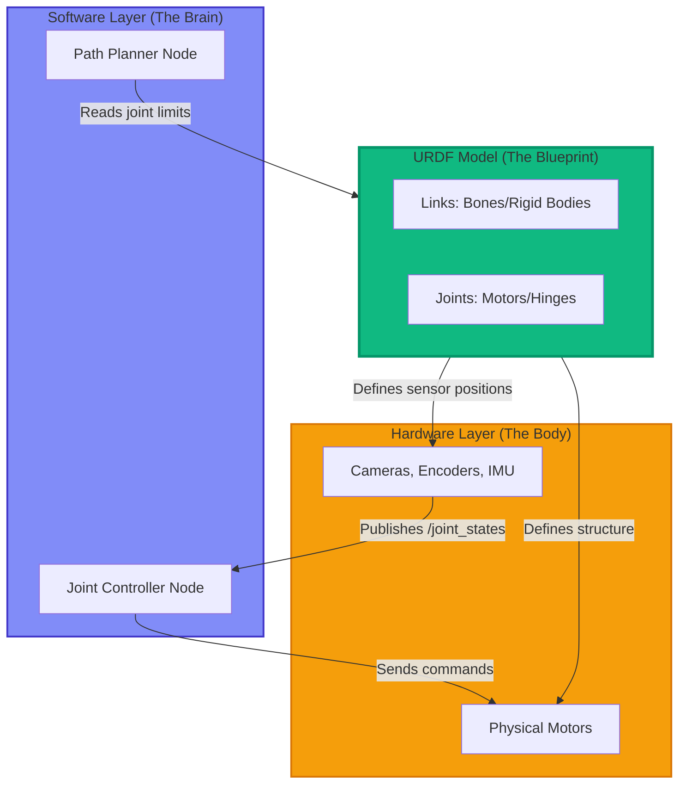

# URDF Modeling: دماغ اور جسم کو جوڑنا

پچھلے sections میں، ہم نے software اعصابی نظام (nodes اور topics) کو تلاش کیا۔ اب ہم روبوٹ کے **فزیکل جسم** کی طرف اپنی توجہ مبذول کرتے ہیں۔ ROS 2 کسی روبوٹ کی geometry، kinematics، اور sensor placements کو کیسے سمجھتا ہے؟ جواب ہے **URDF (Unified Robot Description Format)**۔

---

## URDF کیوں؟ Robot Models کی ضرورت

تصور کریں کہ آپ کسی چیز کو اٹھانے کے لیے robot arm کو control کرنے کی کوشش کر رہے ہیں۔ آپ کے navigation algorithm کو اس طرح کے سوالات کے جوابات درکار ہیں:
- **Camera کہاں mounted ہے؟** (image coordinates کو world coordinates میں transform کرنے کے لیے)
- **ہر arm segment کتنی لمبی ہے؟** (reachability calculate کرنے کے لیے)
- **کون سے joints حرکت کر سکتے ہیں؟** (valid trajectories plan کرنے کے لیے)
- **Collisions کہاں واقع ہوتے ہیں؟** (obstacles سے ٹکرانے سے بچنے کے لیے)

Robot structure کو describe کرنے کے لیے ایک standardized طریقے کے بغیر، ہر algorithm کو custom، hard-coded values کی ضرورت ہوگی۔ **URDF اسے حل کرتا ہے** ایک machine-readable XML format فراہم کر کے جو ان تمام سوالات کا جواب ایک جگہ دیتا ہے۔

### URDF کیا Enable کرتا ہے

✅ **Simulation**: Gazebo اور Isaac Sim حقیقت پسند robot models render کرنے کے لیے URDF استعمال کرتے ہیں
✅ **Visualization**: RViz2 آپ کے روبوٹ کی موجودہ joint states کو 3D میں display کرتا ہے
✅ **Kinematics**: Motion planning libraries URDF chain definitions استعمال کرتے ہوئے inverse kinematics کا حساب لگاتی ہیں
✅ **Sensor Fusion**: Sensor data (camera، lidar) کو local frames سے global map میں transform کریں
✅ **Collision Detection**: Physics engines self-collisions روکنے کے لیے URDF collision geometry استعمال کرتے ہیں

---

## دماغ-جسم کا پل: Topics سے Physical Hardware تک

آئیے trace کریں کہ URDF ROS 2 software layer کو physical robot components سے کیسے جوڑتا ہے:



URDF software algorithms اور physical hardware کے درمیان **interface** پر بیٹھتا ہے، دونوں کے لیے ایک مشترکہ زبان فراہم کرتا ہے۔

---

## URDF Basics: Links (ہڈیاں)

حیاتیاتی تشبیہ میں، **links** آپ کے روبوٹ کی **ہڈیاں** ہیں۔ ایک link ایک **rigid body** ہے — ایک ٹھوس ٹکڑا جو deform نہیں ہوتا۔

### ایک Link کی Anatomy

ہر link کی تین اہم خصوصیات ہیں:

1. **Visual Geometry**: یہ کیسا نظر آتا ہے (RViz اور simulation میں render ہوتا ہے)
2. **Collision Geometry**: Collision detection کے لیے استعمال شدہ shape (اکثر performance کے لیے simplified)
3. **Inertial Properties**: Mass، center of mass، moment of inertia (physics simulation کے لیے)

### مثال: ایک سادہ Cylinder Link

```xml
<link name="base_link">
  <!-- Visual representation (جو آپ RViz میں دیکھتے ہیں) -->
  <visual>
    <geometry>
      <cylinder length="0.1" radius="0.05"/>
    </geometry>
    <origin xyz="0 0 0.05" rpy="0 0 0"/>
    <material name="blue">
      <color rgba="0 0 0.8 1"/>
    </material>
  </visual>

  <!-- Collision geometry (physics calculations کے لیے استعمال ہوتا ہے) -->
  <collision>
    <geometry>
      <cylinder length="0.1" radius="0.05"/>
    </geometry>
    <origin xyz="0 0 0.05" rpy="0 0 0"/>
  </collision>

  <!-- Inertial properties (dynamics simulation کے لیے) -->
  <inertial>
    <mass value="1.0"/>
    <inertia ixx="0.001" ixy="0" ixz="0" iyy="0.001" iyz="0" izz="0.001"/>
  </inertial>
</link>
```

**اہم elements**:
- `<geometry>`: Shape primitives (`<cylinder>`، `<box>`، `<sphere>`) یا custom meshes (`.stl`، `.dae` files)
- `<origin>`: Position (`xyz`) اور orientation (`rpy` = roll-pitch-yaw radians میں) link frame کے مقابلے میں
- `<material>`: Visual appearance (RGBA format میں رنگ)

---

## URDF Basics: Joints (Motors)

**Joints** وہ **motors** یا **hinges** ہیں جو links کو آپس میں جوڑتے ہیں۔ وہ define کرتے ہیں کہ links ایک دوسرے کے مقابلے میں کیسے حرکت کر سکتے ہیں۔

### Joints کی اقسام

| Joint Type | تفصیل | Degrees of Freedom | مثال |
|------------|-------------|-------------------|---------|
| **revolute** | Hinge joint (ایک axis کے گرد گھومتا ہے) | 1 (rotation) | Elbow، shoulder |
| **continuous** | کوئی حدود نہیں والا revolute (ہمیشہ کے لیے گھومتا ہے) | 1 (rotation) | Wheel axle |
| **prismatic** | Sliding joint (linear motion) | 1 (translation) | Elevator، telescope |
| **fixed** | کوئی حرکت نہیں (rigidly attached) | 0 | Camera mount، sensor bracket |
| **floating** | 3D space میں آزاد حرکت | 6 (3 translation + 3 rotation) | Drone، underwater robot |
| **planar** | 2D plane میں حرکت | 3 (2 translation + 1 rotation) | Flat ground پر mobile robot |

### مثال: ایک Revolute Joint (Elbow)

```xml
<joint name="elbow_joint" type="revolute">
  <!-- Parent link (upper arm) -->
  <parent link="upper_arm_link"/>

  <!-- Child link (forearm) -->
  <child link="forearm_link"/>

  <!-- Parent link کے مقابلے میں joint position -->
  <origin xyz="0 0 0.3" rpy="0 0 0"/>

  <!-- Rotation axis (0 1 0 کا مطلب Y-axis کے گرد rotate کریں) -->
  <axis xyz="0 1 0"/>

  <!-- Joint limits -->
  <limit lower="-1.57" upper="1.57" effort="10" velocity="1"/>
</joint>
```

**اہم elements**:
- `<parent>` اور `<child>`: Define کرتے ہیں کہ کون سے links connected ہیں
- `<origin>`: Joint کہاں واقع ہے (parent link کے coordinate frame میں)
- `<axis>`: Rotation کی سمت (unit vector)
- `<limit>`:
  - `lower`/`upper`: Min/max joint angles (radians)
  - `effort`: Maximum torque (Newton-meters)
  - `velocity`: Maximum angular speed (radians/second)

---

## مکمل مثال: 2-Link Robot Arm

آئیے دو links (upper arm، forearm) اور دو revolute joints (shoulder، elbow) والا ایک سادہ robot arm بنائیں۔

### مکمل URDF

اسے `simple_arm.urdf` کے طور پر save کریں:

```xml
<?xml version="1.0"?>
<robot name="simple_arm">

  <!-- ========================================= -->
  <!-- BASE LINK (دنیا سے fixed) -->
  <!-- ========================================= -->
  <link name="base_link">
    <visual>
      <geometry>
        <cylinder length="0.1" radius="0.05"/>
      </geometry>
      <origin xyz="0 0 0.05" rpy="0 0 0"/>
      <material name="blue">
        <color rgba="0 0 0.8 1"/>
      </material>
    </visual>
    <collision>
      <geometry>
        <cylinder length="0.1" radius="0.05"/>
      </geometry>
      <origin xyz="0 0 0.05" rpy="0 0 0"/>
    </collision>
    <inertial>
      <mass value="1.0"/>
      <inertia ixx="0.001" ixy="0" ixz="0" iyy="0.001" iyz="0" izz="0.001"/>
    </inertial>
  </link>

  <!-- ========================================= -->
  <!-- LINK 1 (Upper Arm) -->
  <!-- ========================================= -->
  <link name="link1">
    <visual>
      <geometry>
        <!-- Box: upper arm (5cm x 5cm x 30cm) -->
        <box size="0.05 0.05 0.3"/>
      </geometry>
      <!-- Joint کے اوپر 15cm پر box کو center کریں (30cm اونچائی کا نصف) -->
      <origin xyz="0 0 0.15" rpy="0 0 0"/>
      <material name="red">
        <color rgba="0.8 0 0 1"/>
      </material>
    </visual>
    <collision>
      <geometry>
        <box size="0.05 0.05 0.3"/>
      </geometry>
      <origin xyz="0 0 0.15" rpy="0 0 0"/>
    </collision>
    <inertial>
      <mass value="0.5"/>
      <inertia ixx="0.004" ixy="0" ixz="0" iyy="0.004" iyz="0" izz="0.0001"/>
    </inertial>
  </link>

  <!-- ========================================= -->
  <!-- JOINT 1 (Shoulder - base کو link1 سے جوڑتا ہے) -->
  <!-- ========================================= -->
  <joint name="joint1" type="revolute">
    <parent link="base_link"/>
    <child link="link1"/>
    <!-- Joint base_link origin کے 10cm اوپر ہے -->
    <origin xyz="0 0 0.1" rpy="0 0 0"/>
    <!-- Y-axis کے گرد گھومتا ہے (side-to-side motion) -->
    <axis xyz="0 1 0"/>
    <!-- Joint limits: -90° سے +90° (radians میں) -->
    <limit lower="-1.57" upper="1.57" effort="10" velocity="1"/>
  </joint>

  <!-- ========================================= -->
  <!-- LINK 2 (Forearm) -->
  <!-- ========================================= -->
  <link name="link2">
    <visual>
      <geometry>
        <!-- قدرے چھوٹا box: 4cm x 4cm x 25cm -->
        <box size="0.04 0.04 0.25"/>
      </geometry>
      <!-- Joint کے اوپر 12.5cm پر center -->
      <origin xyz="0 0 0.125" rpy="0 0 0"/>
      <material name="green">
        <color rgba="0 0.8 0 1"/>
      </material>
    </visual>
    <collision>
      <geometry>
        <box size="0.04 0.04 0.25"/>
      </geometry>
      <origin xyz="0 0 0.125" rpy="0 0 0"/>
    </collision>
    <inertial>
      <mass value="0.3"/>
      <inertia ixx="0.002" ixy="0" ixz="0" iyy="0.002" iyz="0" izz="0.0001"/>
    </inertial>
  </link>

  <!-- ========================================= -->
  <!-- JOINT 2 (Elbow - link1 کو link2 سے جوڑتا ہے) -->
  <!-- ========================================= -->
  <joint name="joint2" type="revolute">
    <parent link="link1"/>
    <child link="link2"/>
    <!-- Joint link1 کے اوپری حصے پر ہے (link1 origin کے 30cm اوپر) -->
    <origin xyz="0 0 0.3" rpy="0 0 0"/>
    <!-- Y-axis کے گرد بھی گھومتا ہے -->
    <axis xyz="0 1 0"/>
    <!-- Joint limits: -90° سے +90° -->
    <limit lower="-1.57" upper="1.57" effort="10" velocity="1"/>
  </joint>

</robot>
```

---

### Structure کو سمجھنا

آئیے kinematic chain کو visualize کریں:

```
Base Link (نیلا cylinder)
    ↓ [Joint 1: Shoulder (0, 0, 0.1) پر]
Link 1 (سرخ box، 30cm لمبا)
    ↓ [Joint 2: Elbow Link 1 کے مقابلے میں (0, 0, 0.3) پر]
Link 2 (سبز box، 25cm لمبا)
```

**سیدھے ہونے پر کل اونچائی**: 0.1m (base) + 0.3m (link1) + 0.25m (link2) = **0.65 meters (65cm)**

---

## RViz2 میں Visualize کرنا

اب آئیے اپنے robot arm کو 3D میں دیکھیں!

### Step 1: RViz2 انسٹال کریں (اگر پہلے سے نہیں ہے)

```bash
sudo apt install ros-humble-rviz2
```

### Step 2: Robot State Publisher Launch کریں

`robot_state_publisher` node URDF پڑھتا ہے اور روبوٹ کی structure کو TF (Transform) frames کے طور پر publish کرتا ہے۔

```bash
ros2 run robot_state_publisher robot_state_publisher --ros-args -p robot_description:="$(cat simple_arm.urdf)"
```

**یہ کیا کرتا ہے**:
- `simple_arm.urdf` پڑھتا ہے
- ہر link کے لیے TF transforms publish کرتا ہے
- Robot structure کو RViz کے لیے دستیاب بناتا ہے

### Step 3: RViz2 کھولیں

ایک نئے terminal میں:

```bash
rviz2
```

### Step 4: RViz Configure کریں

1. **Fixed Frame Set کریں**:
   - بائیں panel میں، "Fixed Frame" تلاش کریں
   - `map` سے `base_link` میں تبدیل کریں

2. **RobotModel Display شامل کریں**:
   - نیچے بائیں "Add" button پر click کریں
   - "RobotModel" منتخب کریں
   - "OK" پر click کریں

3. **TF Display شامل کریں** (coordinate frames دیکھنے کے لیے):
   - دوبارہ "Add" پر click کریں
   - "TF" منتخب کریں
   - "OK" پر click کریں

اب آپ کو نظر آنا چاہیے:
- ایک **نیلا cylinder** (base_link)
- ایک **سرخ box** (link1) اوپر کی طرف بڑھتا ہوا
- ایک **سبز box** (link2) link1 کے اوپری حصے سے بڑھتا ہوا
- ہر joint پر **رنگین axes** (TF frames)

🎉 **کامیابی!** اب آپ URDF میں defined کیے گئے robot model کو visualize کر رہے ہیں۔

---

## Coordinate Frames اور TF Tree

URDF میں ہر link ایک **coordinate frame** (جسے TF frame بھی کہتے ہیں) بناتا ہے۔ یہ frames ایک tree structure بناتے ہیں:

```
base_link (root)
    └─ link1 (joint1 کے ذریعے child)
        └─ link2 (joint2 کے ذریعے child)
```

### Transforms کو سمجھنا

ہر joint parent سے child تک ایک **transform** define کرتا ہے:
- **Translation**: `<origin xyz="0 0 0.3"/>` کا مطلب ہے "child parent کے Z-axis میں 30cm اوپر ہے"
- **Rotation**: `rpy="0 0 0"` کا مطلب ہے "کوئی rotation نہیں" (rpy = roll، pitch، yaw)

ROS 2 کی **TF2 library** اس tree کا استعمال اس طرح کے سوالات کے جواب دینے کے لیے کرتی ہے:
- "base_link کے مقابلے میں link2 کی tip کی position کیا ہے؟" (forward kinematics)
- "اگر میرا camera link2 پر ہے، تو world frame میں کوئی object کہاں ہے؟"

### Transforms کو Query کرنا

آپ command line سے transforms query کر سکتے ہیں:

```bash
ros2 run tf2_ros tf2_echo base_link link2
```

**Output**:
```
At time 0.0
- Translation: [0.000, 0.000, 0.650]
- Rotation: in Quaternion [0.000, 0.000, 0.000, 1.000]
```

یہ آپ کو بتاتا ہے کہ جب joints zero position پر ہوں، تو link2 base_link سے 65cm اوپر ہے (بالکل جیسا ہم نے calculate کیا!)۔

---

## عام URDF Patterns

### Pattern 1: Sensor Mounting (Fixed Joint)

Link2 پر camera attach کرنے کے لیے:

```xml
<link name="camera_link">
  <visual>
    <geometry>
      <box size="0.02 0.05 0.02"/>
    </geometry>
    <material name="black">
      <color rgba="0 0 0 1"/>
    </material>
  </visual>
</link>

<joint name="camera_joint" type="fixed">
  <parent link="link2"/>
  <child link="camera_link"/>
  <!-- Camera link2 base کے 25cm اوپر ہے، آگے کی طرف دیکھ رہا ہے -->
  <origin xyz="0 0.03 0.25" rpy="0 0 0"/>
</joint>
```

اب جب link2 حرکت کرے گا، camera اس کے ساتھ حرکت کرے گا!

### Pattern 2: Mesh Files (Custom Geometry)

Primitive shapes کی بجائے، 3D models استعمال کریں:

```xml
<visual>
  <geometry>
    <mesh filename="package://my_robot/meshes/arm_link.stl" scale="1 1 1"/>
  </geometry>
</visual>
```

**نوٹ**: `package://` ایک ROS 2 package کا حوالہ دیتا ہے۔ فی الحال، primitive shapes (box، cylinder، sphere) استعمال کریں۔

---

## Project: Wrist Joint کے ساتھ Arm بڑھائیں

**Challenge**: Robot arm میں 3rd link ("wrist") اور 3rd joint شامل کریں۔

### ضروریات

- Link name: `link3`
- Joint name: `joint3` (type: `revolute`)
- Link dimensions: 3cm x 3cm x 15cm (box)
- Joint limits: -1.0 سے 1.0 radians
- رنگ: پیلا (`rgba="1 1 0 1"`)

**Hints**:
1. `link2` block کو copy کریں اور modify کریں
2. `joint3` شامل کریں جو `link2` (parent) کو `link3` (child) سے connect کرے
3. Joint origin کو `xyz="0 0 0.25"` set کریں (link2 کا اوپری حصہ)

<details>
<summary>Solution ظاہر کرنے کے لیے click کریں</summary>

```xml
<!-- اسے closing </robot> tag سے پہلے شامل کریں -->

<!-- LINK 3 (Wrist) -->
<link name="link3">
  <visual>
    <geometry>
      <box size="0.03 0.03 0.15"/>
    </geometry>
    <origin xyz="0 0 0.075" rpy="0 0 0"/>
    <material name="yellow">
      <color rgba="1 1 0 1"/>
    </material>
  </visual>
  <collision>
    <geometry>
      <box size="0.03 0.03 0.15"/>
    </geometry>
    <origin xyz="0 0 0.075" rpy="0 0 0"/>
  </collision>
  <inertial>
    <mass value="0.1"/>
    <inertia ixx="0.0002" ixy="0" ixz="0" iyy="0.0002" iyz="0" izz="0.00001"/>
  </inertial>
</link>

<!-- JOINT 3 (Wrist) -->
<joint name="joint3" type="revolute">
  <parent link="link2"/>
  <child link="link3"/>
  <origin xyz="0 0 0.25" rpy="0 0 0"/>
  <axis xyz="0 1 0"/>
  <limit lower="-1.0" upper="1.0" effort="5" velocity="1"/>
</joint>
```

**نئی کل اونچائی**: 0.1 + 0.3 + 0.25 + 0.15 = **0.8 meters (80cm)**

</details>

---

## حقیقی دنیا کا سیاق و سباق: URDF سے SLAM تک

آپ سوچ سکتے ہیں: "مجھے AI روبوٹکس کے لیے URDF سیکھنے کی ضرورت کیوں ہے؟"

**Module 3 (Visual SLAM اور Navigation)** میں، آپ URDF files استعمال کریں گے:
- روبوٹ پر cameras اور lidars کہاں mounted ہیں define کرنے کے لیے
- Sensor data کو local frames سے global map میں transform کرنے کے لیے
- Collision-free paths compute کرنے کے لیے جو روبوٹ کے فزیکل dimensions کا احترام کریں
- Execution سے پہلے RViz میں روبوٹ کی planned trajectory visualize کرنے کے لیے

URDF کے بغیر، آپ کا SLAM algorithm نہیں جان سکتا کہ camera پہیوں کے مقابلے میں کہاں ہے، جس سے accurate map بنانا ناممکن ہو جاتا ہے!

---

## خلاصہ اور اگلے قدم

مبارک ہو! آپ نے Module 1: The Robotic Nervous System مکمل کر لیا ہے۔ آئیے recap کریں کہ آپ نے کیا سیکھا:

### Module 1 Recap

**Part 1: ROS 2 کا تعارف**
- ✅ ROS 2 middleware ہے، OS نہیں
- ✅ Nodes neurons ہیں، topics nerve pathways ہیں، services targeted signals ہیں
- ✅ ROS 2 AI software (دماغ) کو robot hardware (جسم) سے bridge کرتا ہے

**Part 2: عملی طور پر Nodes اور Topics**
- ✅ `rclpy` استعمال کرتے ہوئے Python میں ایک Publisher node لکھا
- ✅ ایک Subscriber node لکھا جو messages receive کرتا ہے
- ✅ چلتے ہوئے systems کا معائنہ اور debug کرنے کے لیے ROS 2 CLI tools استعمال کیے

**Part 3: URDF Modeling**
- ✅ Links (ہڈیاں) اور joints (motors) کو سمجھا
- ✅ ایک مکمل 2-link robot arm URDF بنایا
- ✅ RViz2 میں روبوٹ کو visualize کیا
- ✅ Coordinate frames اور TF trees کے بارے میں سیکھا

---

### Module 2 کی طرف پیش رفت: The Digital Twin

اب جب کہ آپ سمجھتے ہیں کہ robots کیسے communicate کرتے ہیں (nodes/topics) اور ان کی structure کیسی ہے (URDF)، آپ **simulation** کے لیے تیار ہیں۔ Module 2 میں، ہم:

- Gazebo launch کریں گے اور robot arm کو simulate کریں گے جو ہم نے ابھی model کیا
- URDF میں sensors (cameras، lidar) شامل کریں گے اور simulated data حاصل کریں گے
- متعدد ذرائع سے data combine کرنے کے لیے sensor fusion implement کریں گے
- Photorealistic rendering کے لیے Unity استعمال کریں گے
- حقیقی hardware پر deploy کرنے سے پہلے simulation میں algorithms test کرنا سیکھیں گے

**Simulate کرنے کے لیے تیار ہیں؟** **[Module 2: The Digital Twin - Simulation اور Sensors](../module-2-digital-twin/01-intro-digital-twin.md)** پر جاری رکھیں 🚀

---

## اہم نکات

✅ **URDF** (Unified Robot Description Format) robot structure describe کرنے کے لیے ایک XML-based زبان ہے

✅ **Links** rigid bodies (ہڈیاں) ہیں جن میں visual، collision، اور inertial properties ہیں

✅ **Joints** define کرتے ہیں کہ links ایک دوسرے کے مقابلے میں کیسے حرکت کرتے ہیں (revolute، prismatic، fixed، وغیرہ)

✅ **Coordinate frames** (TF) ROS 2 کو روبوٹ کے مختلف حصوں کے درمیان data transform کرنے دیتے ہیں

✅ **RViz2** URDF models اور TF trees کو real-time میں visualize کرتا ہے

✅ **robot_state_publisher** URDF اور joint states کی بنیاد پر TF transforms broadcast کرتا ہے

✅ **Primitive shapes** (`<box>`، `<cylinder>`، `<sphere>`) سیکھنے کے لیے meshes سے آسان ہیں

---

**URDF ڈاؤن لوڈ کریں**:
- [simple_arm.urdf](./assets/simple_arm.urdf)
- [simple_arm_with_wrist.urdf](./assets/simple_arm_with_wrist.urdf) (project کا solution)
