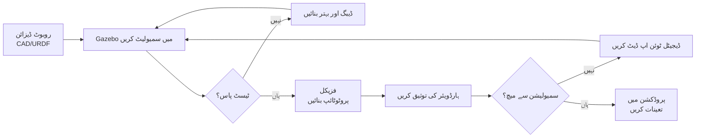

# ڈیجیٹل ٹوئن

## ڈیجیٹل ٹوئن کیا ہے؟

**ڈیجیٹل ٹوئن** آپ کے فزیکل روبوٹ کا ایک ورچوئل کلون ہے جو مکمل طور پر سافٹ ویئر میں موجود ہوتا ہے۔ اسے پائلٹس کے لیے فلائٹ سمیولیٹر کی طرح سمجھیں — اس سے پہلے کہ آپ $3,000+ کے روبوٹ کو کریش کرنے کا خطرہ مول لیں، آپ اسے سمیولیشن میں 100 بار کریش کر کے اپنے الگورتھم کو کامل بناتے ہیں۔

روبوٹکس میں، ڈیجیٹل ٹوئن آپ کی **محفوظ ٹیسٹنگ گراؤنڈ** کے طور پر کام کرتا ہے جہاں آپ کر سکتے ہیں:
- 🧪 **خطرناک منظرناموں کی جانچ** بغیر فزیکل خطرے کے (کناروں سے گرنا، تیز رفتار تصادم)
- 🔄 **تیزی سے دہرانا** — بیٹریاں چارج کرنے، ٹوٹے ہوئے حصے بدلنے، یا فزیکل ہارڈویئر کو ری سیٹ کرنے کی ضرورت نہیں
- 📊 **کامل ڈیٹا اکٹھا کرنا** — سینسرز میں کبھی شور نہیں ہوتا (جب تک آپ حقیقت پسندی کے لیے جان بوجھ کر اضافہ نہ کریں)
- 💰 **پیسے بچانا** — مہنگے سینسرز جیسے LiDAR ($1,500+) خریدنے سے پہلے الگورتھم تیار کریں

### حقیقی دنیا کی مثالیں

- **Boston Dynamics**: Spot کو پہلے فزیکل ٹیسٹ سے پہلے سمیولیشن میں **100,000 سے زیادہ بار** ٹیسٹ کیا گیا
- **NASA**: مریخ کے روورز کو لانچ سے پہلے زمین پر ڈیجیٹل ٹوئن ماحول میں توثیق کیا جاتا ہے
- **Waymo**: خودکار گاڑیوں کو حقیقی دنیا میں تعیناتی سے پہلے سمیولیشن میں **اربوں میل** کے لیے ٹیسٹ کیا جاتا ہے

---

## Sim-to-Real ورک فلو



یہ تکراری چکر اس بات کو یقینی بناتا ہے کہ جب آپ آخر کار اپنے فزیکل روبوٹ کو آن کرتے ہیں، تو کنٹرول الگورتھم پہلے ہی ورچوئل دنیا میں ہزاروں بار جنگ کی آزمائش سے گزر چکے ہوتے ہیں۔

---

## سمیولیشن دھوکہ کیوں نہیں ہے

کچھ انجینئرز ابتدائی طور پر سمیولیشن کی مزاحمت کرتے ہیں، یہ سوچتے ہوئے کہ "حقیقی ہارڈویئر ہی اہم ہے۔" لیکن غور کریں:

- **Airbus A380**: پہلی پرواز سے پہلے، طیارے کو سمیولیشن میں **50,000 سے زیادہ بار** ٹیسٹ کیا گیا
- **SpaceX Falcon 9**: لینڈنگ الگورتھم کو پہلے کامیاب ڈرون شپ لینڈنگ سے پہلے سمیولیشن میں کامل بنایا گیا
- **Formula 1 Racing**: ٹیمیں ٹریک ٹیسٹنگ سے پہلے سمیولیٹرز میں لاکھوں ریس لیپس چلاتی ہیں

**اصول**: اگر ایرو اسپیس اور موٹر اسپورٹس — وہ صنعتیں جہاں غلطیاں لاکھوں کی لاگت آتی ہیں — سمیولیشن پر انحصار کرتی ہیں، تو روبوٹکس کو بھی کرنا چاہیے۔

---

## ہارڈویئر کی ضروریات

:::danger ہائی پرفارمنس GPU درکار ہے

**آپ کو NVIDIA RTX 4070 Ti (12GB VRAM) یا اس سے بہتر کی ضرورت ہے** Isaac Sim اور Gazebo کو high-fidelity sensors کے ساتھ چلانے کے لیے۔

**کیوں؟** حقیقت پسند سینسر سمیولیشن (LiDAR، depth cameras) کو real-time میں روشنی/لیزر کی عکاسیوں کا حساب لگانے کے لیے **GPU ray tracing** کی ضرورت ہوتی ہے۔ RTX GPU کے بغیر:
- **LiDAR سمیولیشن**: 2 FPS (ناقابل استعمال) بمقابلہ 300 FPS (RTX 4070 Ti)
- **Depth camera**: 1 FPS (ناقابل استعمال) بمقابلہ 200 FPS (RTX 4070 Ti)

**کم سے کم**: NVIDIA RTX 4060 (8GB VRAM) — $300
**تجویز کردہ**: NVIDIA RTX 4070 Ti (12GB VRAM) — $800

اگر آپ کے پاس ابھی تک RTX GPU نہیں ہے، تو آپ اب بھی اس ماڈیول میں تصورات سیکھ سکتے ہیں، لیکن سینسر سمیولیشن تیز نہیں ہوگی۔

:::

### سسٹم کی ضروریات

```yaml
Operating System: Ubuntu 22.04 LTS
RAM: 16 GB کم از کم (32 GB تجویز کردہ)
GPU: NVIDIA RTX 4060 یا بہتر (سینسر سمیولیشن کے لیے ضروری)
Storage: 50 GB خالی (Gazebo worlds، Unity projects، اور robot meshes کے لیے)
Software: ROS 2 Humble، Gazebo Fortress، NVIDIA Driver 525+
```

**بجٹ متبادل** (طلباء کے لیے):
- استعمال شدہ RTX 3060 (~$200) — سیکھنے کے لیے مناسب
- AWS EC2 g5.xlarge (~$1/گھنٹہ) — کلاؤڈ میں RTX A10G کرائے پر لیں
- یونیورسٹی لیبز — بہت سی روبوٹکس لیبز میں RTX ورک سٹیشن ہیں

---

## اس ماڈیول میں آگے کیا ہے؟

آنے والے ٹیوٹوریلز میں، آپ:

1. **[Gazebo Fortress کے ساتھ فزکس](./02-gazebo-fortress-setup.md)** — Gazebo انسٹال کریں، gravity اور collisions کے ساتھ اپنی پہلی دنیا بنائیں
2. **[آنکھیں اور کان شامل کرنا (سینسرز)](./03-simulating-sensors.md)** — GPU ray tracing کے ساتھ اپنے روبوٹ میں LiDAR اور depth cameras شامل کریں
3. **[Unity میں High-Fidelity Rendering](./04-unity-visualization.md)** — photorealistic visualization اور synthetic data generation کے لیے Unity استعمال کریں

آگے بڑھنے سے پہلے، اپنے GPU کی تصدیق کریں:

```bash
nvidia-smi
# یہ دکھانا چاہیے: NVIDIA RTX 4060 یا بہتر، Driver 525+
```

اگر کمانڈ ناکام ہو جاتی ہے، تو NVIDIA drivers انسٹال کرنے کے لیے **Module 0: Hardware Setup** دوبارہ دیکھیں۔

---

## اہم نکات

✅ **ڈیجیٹل ٹوئنز** محفوظ، تیز ٹیسٹنگ کے لیے استعمال ہونے والے فزیکل روبوٹس کے ورچوئل کلونز ہیں

✅ **سمیولیشن-فرسٹ ڈیولپمنٹ** صنعتی معیار ہے (Boston Dynamics، NASA، Waymo)

✅ **NVIDIA RTX GPU ضروری** حقیقت پسند سینسر سمیولیشن کے لیے (ray tracing acceleration)

✅ **یہ ماڈیول سکھاتا ہے** Gazebo (physics simulation) اور Unity (visual rendering)

---

## انٹرایکٹو فلیش کارڈز

import Flashcards from '@site/src/components/Flashcards';

<Flashcards
  title="ڈیجیٹل ٹوئن تصورات کا جائزہ"
  cards={[
    {
      id: 1,
      question: "ڈیجیٹل ٹوئن کیا ہے؟",
      answer: "ڈیجیٹل ٹوئن آپ کے فزیکل روبوٹ کا ایک ورچوئل کلون ہے جو مکمل طور پر سافٹ ویئر میں موجود ہے، خطرناک منظرناموں کو test کرنے، تیزی سے iterate کرنے، کامل ڈیٹا جمع کرنے، اور حقیقی ہارڈویئر پر deploy کرنے سے پہلے پیسے بچانے کے لیے محفوظ testing ground کے طور پر استعمال ہوتا ہے۔",
      category: "بنیادی باتیں"
    },
    {
      id: 2,
      question: "Boston Dynamics جیسی کمپنیاں سمیولیشن کیوں استعمال کرتی ہیں؟",
      answer: "Boston Dynamics نے Spot کو اپنے پہلے physical test سے پہلے 100,000 سے زیادہ بار سمیولیشن میں test کیا۔ یہ فزیکل خطرے کے بغیر algorithms کو perfect کرنے، تیزی سے iterate کرنے، اور مہنگے ہارڈویئر پر لاگت کی بچت کی اجازت دیتا ہے۔",
      category: "صنعتی عمل"
    },
    {
      id: 3,
      question: "سم-ٹو-ریئل ورک فلو کیا ہے؟",
      answer: "Robot URDF design کریں → Gazebo میں simulate کریں → Debug اور refine کریں → Physical prototype بنائیں → Hardware validate کریں → ضرورت پڑنے پر digital twin update کریں → Production میں deploy کریں۔ زیادہ تر iteration ہارڈویئر چھونے سے پہلے simulation میں ہوتی ہے۔",
      category: "ورک فلو"
    },
    {
      id: 4,
      question: "سینسر سمیولیشن کے لیے NVIDIA RTX GPU کیوں ضروری ہے؟",
      answer: "حقیقت پسند سینسر سمیولیشن (LiDAR، depth cameras) کو real-time میں روشنی/لیزر reflections calculate کرنے کے لیے GPU ray tracing کی ضرورت ہے۔ RTX 4070 Ti LiDAR کے لیے 300 FPS حاصل کرتا ہے بمقابلہ CPU پر 2 FPS - 150x speedup جو development کو ممکن بناتا ہے۔",
      category: "ہارڈویئر کی ضروریات"
    },
    {
      id: 5,
      question: "اس ماڈیول کے لیے کم سے کم system requirements کیا ہیں؟",
      answer: "Ubuntu 22.04 LTS، 16GB RAM (32GB تجویز کردہ)، NVIDIA RTX 4060 یا بہتر GPU، 50GB storage، ROS 2 Humble، Gazebo Fortress، اور NVIDIA Driver 525+۔",
      category: "سیٹ اپ"
    }
  ]}
/>

---

**اپنا پہلا ڈیجیٹل ٹوئن بنانے کے لیے تیار ہیں؟** سمیولیشن دنیائیں بنانے کے لیے [**Gazebo Fortress کے ساتھ فزکس**](./02-gazebo-fortress-setup.md) پر جائیں! 🚀
