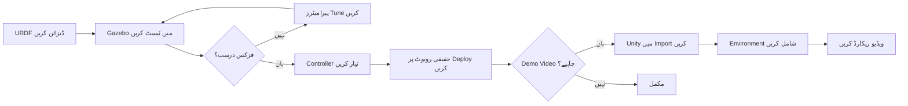

# Unity میں High-Fidelity Rendering

## جب ہمارے پاس Gazebo ہے تو Unity کیوں؟

**Gazebo Fortress** **فزکس simulation** اور sensor testing کے لیے بہترین ہے، لیکن اس کی حدود ہیں جب آپ کو ضرورت ہو:

- 🎨 **Photorealistic rendering** presentations، demos، یا marketing materials کے لیے
- 👤 **Human-robot interaction (HRI)** — لوگوں کو روبوٹس کے ارد گرد چلتے ہوئے simulate کرنا
- 🌍 **پیچیدہ ماحول** — تفصیلی اندرونی مناظر (فرنیچر، روشنی، عکاسیں)
- 📹 **Cinematic camera control** — ویڈیو پروڈکشن کے لیے smooth camera movements
- 🧠 **Synthetic data generation** — کامل labels کے ساتھ computer vision models کی تربیت

### ہر ایک کب استعمال کریں

| استعمال کی صورت | Gazebo Fortress | Unity |
|----------|----------------|-------|
| **Physics testing** | ✅ بہترین انتخاب (درست ODE/Bullet physics) | ⚠️ ٹھیک (PhysX، robotics کے لیے کم tuned) |
| **Sensor simulation** | ✅ بہترین انتخاب (GPU ray tracing، ROS 2 native) | ⚠️ ٹھیک (custom scripts کی ضرورت ہے) |
| **Control algorithm development** | ✅ بہترین انتخاب (1ms time step، deterministic) | ❌ تجویز نہیں (variable time step) |
| **Photorealistic visualization** | ❌ محدود (بنیادی shaders) | ✅ بہترین انتخاب (HDRP، ray tracing) |
| **Human-robot interaction** | ❌ کوئی built-in humanoid AI نہیں | ✅ بہترین انتخاب (NavMesh، crowd simulation) |
| **Synthetic dataset generation** | ⚠️ ٹھیک (بنیادی labels) | ✅ بہترین انتخاب (کامل segmentation masks) |

**بہترین مشق**: اپنے روبوٹ کو **Gazebo** میں تیار اور ٹیسٹ کریں، پھر visualization، demos، یا dataset generation کے لیے **Unity** میں import کریں۔

---

## Unity Robotics Hub

**Unity Robotics Hub** Unity کا سرکاری ROS integration package ہے۔ یہ فراہم کرتا ہے:

1. **ROS-TCP-Connector** — Unity اور ROS 2 کے درمیان TCP کے ذریعے دو طرفہ رابطہ (port 10000)
2. **URDF Importer** — اپنے روبوٹ کی URDF فائل براہ راست Unity scenes میں import کریں
3. **Articulation Body** — robotic joints (revolute، prismatic) کے لیے Unity کا physics component
4. **Visualization Tools** — ROS 2 topics (`/joint_states`، `/tf`، `/camera/image_raw`) subscribe کریں

### معماری

```
ROS 2 Node (Ubuntu)          Unity Scene (Windows/Mac/Linux)
┌──────────────────┐         ┌──────────────────────┐
│  /joint_states   │────TCP──→│ Articulation Body   │
│  Publisher       │ Port     │ (Robot Model)        │
│                  │ 10000    │                      │
│  /cmd_vel        │←───TCP───│ C# Subscriber        │
│  Subscriber      │          │ (User Input)         │
└──────────────────┘         └──────────────────────┘
```

`ros_gz_bridge` (جو DDS استعمال کرتا ہے) کے برعکس، Unity cross-platform compatibility کے لیے **TCP sockets** استعمال کرتا ہے (Unity Windows پر چل سکتا ہے، جہاں ROS 2 DDS میں حدود ہیں)۔

---

## تنصیب

### قدم 1: Unity Hub اور Unity Editor انسٹال کریں

**Unity Hub** launcher ہے جو Unity versions manage کرتا ہے۔

```bash
# Unity Hub ڈاؤن لوڈ کریں (Linux)
wget https://public-cdn.cloud.unity3d.com/hub/prod/UnityHubSetup.AppImage
chmod +x UnityHubSetup.AppImage
./UnityHubSetup.AppImage
```

**Windows/Mac**: Unity Hub [https://unity.com/download](https://unity.com/download) سے ڈاؤن لوڈ کریں

ایک بار Unity Hub انسٹال ہونے کے بعد:

1. Unity Hub کھولیں
2. **"Installs"** → **"Install Editor"** پر کلک کریں
3. **Unity 2021.3 LTS** منتخب کریں (Long-Term Support، robotics کے لیے stable)
4. Modules شامل کریں:
   - ✅ Linux Build Support (اگر Ubuntu پر ہیں)
   - ✅ Windows Build Support (اگر Windows پر ہیں)

**2021.3 LTS کیوں؟** Unity Robotics Hub اس version کے ساتھ tested ہے۔ نئے versions (2022+) میں compatibility issues ہو سکتے ہیں۔

---

### قدم 2: ROS-TCP-Endpoint انسٹال کریں (ROS 2 Side)

یہ **server** ہے جو آپ کی ROS 2 مشین پر چلتا ہے اور Unity connections کے لیے سنتا ہے۔

```bash
# اپنے ROS 2 workspace پر جائیں
cd ~/ros2_ws/src

# ROS-TCP-Endpoint package clone کریں
git clone https://github.com/Unity-Technologies/ROS-TCP-Endpoint.git

# Workspace build کریں
cd ~/ros2_ws
colcon build --packages-select ros_tcp_endpoint

# Workspace source کریں
source install/setup.bash
```

**Endpoint لانچ کریں**:

```bash
ros2 run ros_tcp_endpoint default_server_endpoint --ros-args -p ROS_IP:=0.0.0.0
```

**متوقع Output**:
```
[INFO] [ros_tcp_endpoint]: ROS-TCP Endpoint listening on 0.0.0.0:10000
```

یہ server اب Unity کے connect ہونے کا انتظار کرتا ہے۔

---

### قدم 3: Unity Project بنائیں اور Robotics Hub Import کریں

1. Unity Hub کھولیں → **"New Project"**
2. **3D (URP)** template منتخب کریں (بہتر graphics کے لیے Universal Render Pipeline)
3. Project Name: `RobotVisualization`
4. **"Create Project"** پر کلک کریں

**Unity Robotics Hub Import کریں**:

1. Unity Editor میں، **Window → Package Manager** پر جائیں
2. **"+"** → **"Add package from git URL"** پر کلک کریں
3. داخل کریں: `https://github.com/Unity-Technologies/ROS-TCP-Connector.git?path=/com.unity.robotics.ros-tcp-connector`
4. **"Add"** پر کلک کریں
5. URDF Importer کے لیے دہرائیں: `https://github.com/Unity-Technologies/URDF-Importer.git?path=/com.unity.robotics.urdf-importer`

**تنصیب کی تصدیق کریں**:
- **Robotics → ROS Settings** پر جائیں
- آپ کو "ROS IP Address" field نظر آنا چاہیے

---

### قدم 4: ROS Connection کنفیگر کریں

1. Unity میں، **Robotics → ROS Settings** پر جائیں
2. **Protocol** سیٹ کریں: `ROS2`
3. **ROS IP Address** سیٹ کریں: `127.0.0.1` (اگر Unity اور ROS 2 ایک ہی مشین پر ہیں)
   - اگر مختلف مشینوں پر ہیں: اپنی Ubuntu مشین کا IP استعمال کریں (مثلاً `192.168.1.100`)
4. **ROS Port** سیٹ کریں: `10000`
5. **"Connect"** پر کلک کریں

**متوقع**: سبز indicator "Connected to ROS" دکھا رہا ہے

---

## اپنا روبوٹ URDF Import کرنا

آئیے Module 1 سے روبوٹ کو Unity میں import کریں۔

### قدم 1: URDF اور Meshes کاپی کریں

```bash
# اپنے روبوٹ کی URDF اور meshes Unity-accessible location پر کاپی کریں
cp -r ~/ros2_ws/src/my_robot_description/urdf ~/Desktop/robot_urdf
cp -r ~/ros2_ws/src/my_robot_description/meshes ~/Desktop/robot_urdf/
```

### قدم 2: Unity میں Import کریں

1. Unity میں، **Assets → Import Robot from URDF** پر جائیں
2. **"Browse"** پر کلک کریں → اپنے روبوٹ کی URDF فائل منتخب کریں
3. Import Settings:
   - ✅ **Import Meshes**
   - ✅ **Create Articulation Body** (physics کے لیے)
   - ✅ **Generate Unique Names**
4. **"Import"** پر کلک کریں

**نتیجہ**: آپ کا روبوٹ تمام links اور joints کے ساتھ Unity Scene view میں ظاہر ہوتا ہے!

---

## ROS 2 سے Joint States کو Visualize کرنا

آئیے ایک C# script بنائیں تاکہ `/joint_states` subscribe کریں اور Unity میں روبوٹ کو منتقل کریں۔

### `JointStateSubscriber.cs` بنائیں

```csharp
using UnityEngine;
using Unity.Robotics.ROSTCPConnector;
using RosMessageTypes.Sensor;

public class JointStateSubscriber : MonoBehaviour
{
    private ArticulationBody[] articulationChain;

    void Start()
    {
        // روبوٹ میں تمام articulation bodies حاصل کریں
        articulationChain = GetComponentsInChildren<ArticulationBody>();

        // /joint_states topic subscribe کریں
        ROSConnection.GetOrCreateInstance().Subscribe<JointStateMsg>(
            "/joint_states", UpdateJointStates);
    }

    void UpdateJointStates(JointStateMsg jointState)
    {
        // Joint names کو articulation bodies سے match کریں
        for (int i = 0; i < jointState.name.Length; i++)
        {
            string jointName = jointState.name[i];
            float position = (float)jointState.position[i];

            // Matching articulation body تلاش کریں
            foreach (var joint in articulationChain)
            {
                if (joint.name == jointName && joint.jointType != ArticulationJointType.FixedJoint)
                {
                    // Joint target position سیٹ کریں (radians سے degrees)
                    var drive = joint.xDrive;
                    drive.target = position * Mathf.Rad2Deg;
                    joint.xDrive = drive;
                }
            }
        }
    }
}
```

### Script کو روبوٹ سے Attach کریں

1. Unity Hierarchy میں، اپنے روبوٹ کا **root object** منتخب کریں
2. Inspector میں، **"Add Component"** → `JointStateSubscriber` تلاش کریں پر کلک کریں
3. Unity Editor میں **"Play"** پر کلک کریں

**ٹیسٹ**:

```bash
# ROS 2 terminal میں، joint states شائع کریں
ros2 topic pub /joint_states sensor_msgs/JointState "{name: ['wheel_left_joint', 'wheel_right_joint'], position: [1.5, 1.5]}"
```

**نتیجہ**: روبوٹ کے پہیے Unity میں real-time میں گھومتے ہیں! 🎉

---

## Photorealistic Environment شامل کرنا

Unity کی طاقت **بصری وفاداری** ہے۔ آئیے ایک حقیقت پسند ماحول شامل کریں۔

### HDRP شامل کریں (High Definition Render Pipeline)

1. **Window → Package Manager** → **"High Definition RP"** تلاش کریں
2. **"Install"** پر کلک کریں
3. **Edit → Render Pipeline → HD Render Pipeline → Wizard**
4. Materials اپ گریڈ کرنے کے لیے **"Fix All"** پر کلک کریں

### Environment Assets شامل کریں

1. **Window → Asset Store**
2. **"Modern Office Interior"** تلاش کریں (مفت asset)
3. **"Download"** → **"Import"** پر کلک کریں
4. Office prefab کو اپنے scene میں drag کریں
5. اپنے روبوٹ کو دفتر کے اندر position کریں

**نتیجہ**: آپ کا روبوٹ اب real-time reflections، shadows، اور ambient occlusion کے ساتھ ایک photorealistic دفتری ماحول میں موجود ہے — demos کے لیے بہترین!

---

## Unity بمقابلہ Gazebo: ورک فلو

### تجویز کردہ ورک فلو



**انگوٹھے کا اصول**:
- **Gazebo**: ڈیولپمنٹ کے لیے (آپ کے وقت کا 80%)
- **Unity**: presentation کے لیے (آپ کے وقت کا 20%)

---

## کارکردگی کی ضروریات

Gazebo کے برعکس (جس کو sensor simulation کے لیے NVIDIA RTX کی ضرورت ہے)، Unity بنیادی visualization کے لیے **کم GPU-intensive** ہے:

- **کم سے کم**: Intel UHD Graphics (integrated GPU) — بنیادی materials کے ساتھ 30 FPS
- **تجویز کردہ**: NVIDIA GTX 1660 یا بہتر — HDRP کے ساتھ 60 FPS
- **بہترین**: NVIDIA RTX 4060 یا بہتر — ray tracing کے ساتھ 120+ FPS

**فرق کیوں؟** Unity کی rendering gaming کے لیے optimized ہے (اربوں ڈالر R&D میں)، جبکہ Gazebo بصری کارکردگی پر فزکس کی درستگی کو ترجیح دیتا ہے۔

---

## عام مسائل

### Unity ROS 2 سے connect نہیں ہو سکتا

**Debug**:

```bash
# چیک کریں کہ آیا ROS-TCP-Endpoint چل رہا ہے
ros2 node list | grep tcp

# Firewall چیک کریں (Linux)
sudo ufw allow 10000/tcp
```

**حل**: تصدیق کریں کہ Unity ROS Settings میں IP address آپ کی Ubuntu مشین کے IP سے match کرتا ہے (تلاش کرنے کے لیے `ip addr` استعمال کریں)۔

### روبوٹ ظاہر ہوتا ہے لیکن حرکت نہیں کرتا

**Debug**: چیک کریں کہ آیا `/joint_states` topic شائع ہو رہا ہے:

```bash
ros2 topic echo /joint_states
```

**حل**: یقینی بنائیں کہ آپ کا ROS 2 node `/joint_states` پر شائع کرتا ہے اور Unity کی C# script joint names کو بالکل match کرتی ہے (case-sensitive!)۔

### Meshes load نہیں ہو رہیں

**حل**: یقینی بنائیں کہ mesh فائلیں (`.dae`، `.stl`) URDF کے ساتھ ایک ہی directory میں ہیں یا URDF `<mesh filename="...">` tags میں absolute paths استعمال کریں۔

---

## اہم نکات

✅ **Unity visualization کے لیے ہے**، Gazebo physics testing کے لیے

✅ **Unity Robotics Hub** TCP (port 10000) کے ذریعے ROS 2 integration فراہم کرتا ہے

✅ **URDF Importer** آپ کو Unity میں اپنے Gazebo robot models دوبارہ استعمال کرنے دیتا ہے

✅ **Unity 2021.3 LTS انسٹال کریں** (robotics کے لیے سب سے زیادہ stable)

✅ **C# scripts** ROS 2 topics subscribe کرتے ہیں اور Unity GameObjects control کرتے ہیں

✅ **HDRP** demos اور marketing کے لیے photorealistic rendering فعال کرتا ہے

✅ Gazebo sensor simulation سے **کم GPU-intensive** (GTX 1660 کافی ہے)

---

## Module 2 کوئز

import Quiz from '@site/src/components/Quiz';

<Quiz
  title="Module 2: ڈیجیٹل ٹوئن اور سمیولیشن مہارت کوئز"
  questions={[
    {
      id: 1,
      question: "آپ کو Gazebo کی بجائے Unity کب استعمال کرنا چاہیے؟",
      options: [
        "Physics testing اور control algorithm development کے لیے",
        "Photorealistic visualization، human-robot interaction، اور synthetic dataset generation کے لیے",
        "LiDAR کے ساتھ real-time sensor simulation کے لیے",
        "Unity کو robotics کے لیے کبھی استعمال نہیں کرنا چاہیے"
      ],
      correctAnswer: 1,
      explanation: "Unity photorealistic rendering (HDRP، ray tracing)، human-robot interaction (NavMesh، crowd simulation)، اور synthetic dataset generation (perfect segmentation masks) میں بہترین ہے۔ Gazebo physics testing، sensor simulation، اور deterministic time steps کے ساتھ control algorithm development کے لیے بہتر ہے۔"
    },
    {
      id: 2,
      question: "Robotics میں digital twin کیا ہے؟",
      options: [
        "Cloud میں محفوظ robot software کی backup copy",
        "آپ کے physical robot کا ایک virtual clone جو محفوظ testing کے لیے مکمل طور پر software میں موجود ہے",
        "Spare parts کے لیے استعمال ہونے والا دوسرا identical physical robot",
        "دو robots کے درمیان network connection"
      ],
      correctAnswer: 1,
      explanation: "Digital twin آپ کے physical robot کا ایک virtual clone ہے جو مکمل طور پر software میں موجود ہے۔ یہ خطرناک scenarios test کرنے، تیزی سے iterate کرنے، perfect data جمع کرنے، اور algorithms کو حقیقی hardware پر deploy کرنے سے پہلے پیسے بچانے کے لیے محفوظ testing ground کا کام کرتا ہے۔"
    },
    {
      id: 3,
      question: "Gazebo میں sensor simulation کے لیے NVIDIA RTX GPU کیوں ضروری ہے؟",
      options: [
        "RTX GPUs میں عام GPUs سے زیادہ RAM ہوتی ہے",
        "RTX GPUs GPU ray tracing acceleration فراہم کرتے ہیں، 10-100x speedup حاصل کرتے ہیں (LiDAR کے لیے 300 FPS بمقابلہ 2 FPS)",
        "Unity کو RTX GPUs چلانے کی ضرورت ہے",
        "RTX GPUs دوسرے options سے سستے ہیں"
      ],
      correctAnswer: 1,
      explanation: "حقیقت پسند sensor simulation (LiDAR، depth cameras) کو real-time میں light/laser reflections calculate کرنے کے لیے GPU ray tracing کی ضرورت ہے۔ 10 Hz پر 16-beam LiDAR 2.3 million rays فی سیکنڈ shoot کرتا ہے۔ RTX GPUs 300 FPS بمقابلہ CPU پر 2 FPS حاصل کرتے ہیں - 150x speedup جو real-time development کو ممکن بناتا ہے۔"
    },
    {
      id: 4,
      question: "URDF اور SDF formats کے درمیان بنیادی فرق کیا ہے؟",
      options: [
        "URDF صرف robots کے لیے ہے، SDF worlds (ground planes، obstacles، lighting) اور advanced physics کو support کرتا ہے",
        "SDF پرانا اور deprecated ہے، URDF جدید معیار ہے",
        "URDF صرف simulation کے لیے ہے، SDF صرف حقیقی robots کے لیے",
        "یہ مختلف file extensions کے ساتھ identical formats ہیں"
      ],
      correctAnswer: 0,
      explanation: "URDF robot descriptions کے لیے ہے (فی file ایک model، basic physics)۔ SDF متعدد models، ground planes، obstacles، lighting، اور advanced physics (friction، damping، complex surface properties) کے ساتھ simulation worlds کو support کرتا ہے۔ بہترین عمل: robots کے لیے URDF، worlds کے لیے SDF۔"
    },
    {
      id: 5,
      question: "Unity ROS 2 کے ساتھ کیسے communicate کرتا ہے؟",
      options: [
        "Gazebo کی طرح DDS middleware کے ذریعے",
        "Port 10000 پر ROS-TCP-Connector استعمال کرتے ہوئے TCP sockets کے ذریعے",
        "روبوٹ سے منسلک USB cables کے ذریعے",
        "Unity ROS 2 کے ساتھ communicate نہیں کر سکتا"
      ],
      correctAnswer: 1,
      explanation: "Unity port 10000 پر TCP sockets کے ذریعے ROS 2 کے ساتھ bidirectional communication کے لیے ROS-TCP-Connector استعمال کرتا ہے۔ یہ Gazebo کے DDS approach سے مختلف ہے اور cross-platform compatibility فعال کرتا ہے (Unity Windows پر چل سکتا ہے جہاں ROS 2 DDS کی limitations ہیں)۔"
    },
    {
      id: 6,
      question: "Gazebo میں تجویز کردہ physics time step کیا ہے اور کیوں؟",
      options: [
        "سادگی کے لیے 1 second (1.0s)",
        "1 millisecond (0.001s) - stability اور speed کو balance کرتا ہے، objects کو ایک دوسرے سے tunnel through ہونے سے روکتا ہے",
        "زیادہ سے زیادہ accuracy کے لیے 0.0001s",
        "تیز ترین performance کے لیے 0.1s"
      ],
      correctAnswer: 1,
      explanation: "1ms (0.001s) زیادہ تر robotics applications کے لیے sweet spot ہے۔ چھوٹے time steps (0.0001s) زیادہ accurate لیکن سست ہوتے ہیں۔ بڑے time steps (0.01s) تیز لیکن collisions کے دوران objects ایک دوسرے سے tunnel through ہو سکتی ہیں۔ 1ms دونوں خدشات کو balance کرتا ہے۔"
    },
    {
      id: 7,
      question: "Robotics development کے لیے کون سا Unity version تجویز کیا جاتا ہے؟",
      options: [
        "Unity 2023 (تازہ ترین version)",
        "Unity 2021.3 LTS (Long-Term Support، Unity Robotics Hub کے ساتھ tested)",
        "Unity 2018 (سب سے زیادہ stable)",
        "کوئی بھی version یکساں طور پر اچھا کام کرتا ہے"
      ],
      correctAnswer: 1,
      explanation: "Unity 2021.3 LTS (Long-Term Support) تجویز کیا جاتا ہے کیونکہ Unity Robotics Hub اس version کے لیے tested اور optimized ہے۔ LTS versions breaking changes کے بغیر bug fixes اور stability updates حاصل کرتے ہیں۔ نئے versions (2022+) میں compatibility issues ہو سکتے ہیں۔"
    },
    {
      id: 8,
      question: "Gazebo LiDAR sensor میں update_rate parameter کیا control کرتا ہے؟",
      options: [
        "GPU clock speed",
        "کتنے scans فی سیکنڈ (Hz) sensor publish کرتا ہے",
        "Meters میں maximum detection range",
        "Laser beams کی تعداد"
      ],
      correctAnswer: 1,
      explanation: "update_rate سیٹ کرتا ہے کہ کتنے scans فی سیکنڈ (Hz) ہوں۔ زیادہ rate = زیادہ data لیکن زیادہ CPU/GPU load۔ 10 Hz navigation کے لیے معیاری ہے (اچھا balance)، 20 Hz autonomous cars جیسے high-speed applications کے لیے، 5 Hz low-end systems کے لیے۔"
    },
    {
      id: 9,
      question: "سم-ٹو-ریئل workflow کیا ہے؟",
      options: [
        "حقیقی روبوٹ سے simulation میں code copy کریں",
        "URDF design کریں → Gazebo میں test کریں → Debug کریں → Prototype بنائیں → Validate کریں → Production میں deploy کریں",
        "ہمیشہ پہلے حقیقی hardware پر test کریں، پھر simulate کریں",
        "Simulation اور حقیقی robots الگ الگ develop کیے جاتے ہیں"
      ],
      correctAnswer: 1,
      explanation: "سم-ٹو-ریئل workflow یہ ہے: Robot URDF design کریں → Gazebo میں simulate کریں → Physics test کریں → Debug اور refine کریں → Physical prototype بنائیں → Hardware کو sim سے match کرنا validate کریں → ضرورت پڑنے پر digital twin update کریں → Production میں deploy کریں۔ ہارڈویئر چھونے سے پہلے زیادہ تر iteration simulation میں ہوتی ہے تاکہ وقت اور پیسے بچائے جائیں۔"
    },
    {
      id: 10,
      question: "Simulated sensors میں Gaussian noise کیوں شامل کریں؟",
      options: [
        "Simulation کو تیزی سے چلانے کے لیے",
        "Simulation کو زیادہ realistic بنانے اور algorithm کی robustness کو real-world sensor کی خامیوں کے خلاف test کرنے کے لیے",
        "GPU memory کا استعمال کم کرنے کے لیے",
        "Sensors میں کبھی noise شامل نہیں کرنا چاہیے"
      ],
      correctAnswer: 1,
      explanation: "حقیقی sensors میں noise ہوتا ہے! Gaussian noise شامل کرنا (مثلاً LiDAR میں ±1cm error کے لیے stddev 0.01) simulation کو زیادہ realistic بناتا ہے اور آپ کے algorithms کو real-world sensor کی خامیوں کے خلاف robust بننے میں مدد کرتا ہے۔ آپ debugging کے وقت perfect measurements کے لیے noise ہٹا سکتے ہیں، پھر realistic testing کے لیے واپس شامل کر سکتے ہیں۔"
    }
  ]}
  passingScore={70}
/>

---

**اگلا**: اب جب آپ نے digital twins میں مہارت حاصل کر لی ہے، تو sensor processing اور perception algorithms کے ساتھ اپنے روبوٹ کو **ذہین** بنانے کا وقت ہے **Module 3: Sensory Processing** میں! 🧠
