# Unity میں High-Fidelity Rendering

## جب ہمارے پاس Gazebo ہے تو Unity کیوں؟

**Gazebo Fortress** **فزکس simulation** اور sensor testing کے لیے بہترین ہے، لیکن اس کی حدود ہیں جب آپ کو ضرورت ہو:

- 🎨 **Photorealistic rendering** presentations، demos، یا marketing materials کے لیے
- 👤 **Human-robot interaction (HRI)** — لوگوں کو روبوٹس کے ارد گرد چلتے ہوئے simulate کرنا
- 🌍 **پیچیدہ ماحول** — تفصیلی اندرونی مناظر (فرنیچر، روشنی، عکاسیں)
- 📹 **Cinematic camera control** — ویڈیو پروڈکشن کے لیے smooth camera movements
- 🧠 **Synthetic data generation** — کامل labels کے ساتھ computer vision models کی تربیت

### ہر ایک کب استعمال کریں

| استعمال کی صورت | Gazebo Fortress | Unity |
|----------|----------------|-------|
| **Physics testing** | ✅ بہترین انتخاب (درست ODE/Bullet physics) | ⚠️ ٹھیک (PhysX، robotics کے لیے کم tuned) |
| **Sensor simulation** | ✅ بہترین انتخاب (GPU ray tracing، ROS 2 native) | ⚠️ ٹھیک (custom scripts کی ضرورت ہے) |
| **Control algorithm development** | ✅ بہترین انتخاب (1ms time step، deterministic) | ❌ تجویز نہیں (variable time step) |
| **Photorealistic visualization** | ❌ محدود (بنیادی shaders) | ✅ بہترین انتخاب (HDRP، ray tracing) |
| **Human-robot interaction** | ❌ کوئی built-in humanoid AI نہیں | ✅ بہترین انتخاب (NavMesh، crowd simulation) |
| **Synthetic dataset generation** | ⚠️ ٹھیک (بنیادی labels) | ✅ بہترین انتخاب (کامل segmentation masks) |

**بہترین مشق**: اپنے روبوٹ کو **Gazebo** میں تیار اور ٹیسٹ کریں، پھر visualization، demos، یا dataset generation کے لیے **Unity** میں import کریں۔

---

## Unity Robotics Hub

**Unity Robotics Hub** Unity کا سرکاری ROS integration package ہے۔ یہ فراہم کرتا ہے:

1. **ROS-TCP-Connector** — Unity اور ROS 2 کے درمیان TCP کے ذریعے دو طرفہ رابطہ (port 10000)
2. **URDF Importer** — اپنے روبوٹ کی URDF فائل براہ راست Unity scenes میں import کریں
3. **Articulation Body** — robotic joints (revolute، prismatic) کے لیے Unity کا physics component
4. **Visualization Tools** — ROS 2 topics (`/joint_states`، `/tf`، `/camera/image_raw`) subscribe کریں

### معماری

```
ROS 2 Node (Ubuntu)          Unity Scene (Windows/Mac/Linux)
┌──────────────────┐         ┌──────────────────────┐
│  /joint_states   │────TCP──→│ Articulation Body   │
│  Publisher       │ Port     │ (Robot Model)        │
│                  │ 10000    │                      │
│  /cmd_vel        │←───TCP───│ C# Subscriber        │
│  Subscriber      │          │ (User Input)         │
└──────────────────┘         └──────────────────────┘
```

`ros_gz_bridge` (جو DDS استعمال کرتا ہے) کے برعکس، Unity cross-platform compatibility کے لیے **TCP sockets** استعمال کرتا ہے (Unity Windows پر چل سکتا ہے، جہاں ROS 2 DDS میں حدود ہیں)۔

---

## تنصیب

### قدم 1: Unity Hub اور Unity Editor انسٹال کریں

**Unity Hub** launcher ہے جو Unity versions manage کرتا ہے۔

```bash
# Unity Hub ڈاؤن لوڈ کریں (Linux)
wget https://public-cdn.cloud.unity3d.com/hub/prod/UnityHubSetup.AppImage
chmod +x UnityHubSetup.AppImage
./UnityHubSetup.AppImage
```

**Windows/Mac**: Unity Hub [https://unity.com/download](https://unity.com/download) سے ڈاؤن لوڈ کریں

ایک بار Unity Hub انسٹال ہونے کے بعد:

1. Unity Hub کھولیں
2. **"Installs"** → **"Install Editor"** پر کلک کریں
3. **Unity 2021.3 LTS** منتخب کریں (Long-Term Support، robotics کے لیے stable)
4. Modules شامل کریں:
   - ✅ Linux Build Support (اگر Ubuntu پر ہیں)
   - ✅ Windows Build Support (اگر Windows پر ہیں)

**2021.3 LTS کیوں؟** Unity Robotics Hub اس version کے ساتھ tested ہے۔ نئے versions (2022+) میں compatibility issues ہو سکتے ہیں۔

---

### قدم 2: ROS-TCP-Endpoint انسٹال کریں (ROS 2 Side)

یہ **server** ہے جو آپ کی ROS 2 مشین پر چلتا ہے اور Unity connections کے لیے سنتا ہے۔

```bash
# اپنے ROS 2 workspace پر جائیں
cd ~/ros2_ws/src

# ROS-TCP-Endpoint package clone کریں
git clone https://github.com/Unity-Technologies/ROS-TCP-Endpoint.git

# Workspace build کریں
cd ~/ros2_ws
colcon build --packages-select ros_tcp_endpoint

# Workspace source کریں
source install/setup.bash
```

**Endpoint لانچ کریں**:

```bash
ros2 run ros_tcp_endpoint default_server_endpoint --ros-args -p ROS_IP:=0.0.0.0
```

**متوقع Output**:
```
[INFO] [ros_tcp_endpoint]: ROS-TCP Endpoint listening on 0.0.0.0:10000
```

یہ server اب Unity کے connect ہونے کا انتظار کرتا ہے۔

---

### قدم 3: Unity Project بنائیں اور Robotics Hub Import کریں

1. Unity Hub کھولیں → **"New Project"**
2. **3D (URP)** template منتخب کریں (بہتر graphics کے لیے Universal Render Pipeline)
3. Project Name: `RobotVisualization`
4. **"Create Project"** پر کلک کریں

**Unity Robotics Hub Import کریں**:

1. Unity Editor میں، **Window → Package Manager** پر جائیں
2. **"+"** → **"Add package from git URL"** پر کلک کریں
3. داخل کریں: `https://github.com/Unity-Technologies/ROS-TCP-Connector.git?path=/com.unity.robotics.ros-tcp-connector`
4. **"Add"** پر کلک کریں
5. URDF Importer کے لیے دہرائیں: `https://github.com/Unity-Technologies/URDF-Importer.git?path=/com.unity.robotics.urdf-importer`

**تنصیب کی تصدیق کریں**:
- **Robotics → ROS Settings** پر جائیں
- آپ کو "ROS IP Address" field نظر آنا چاہیے

---

### قدم 4: ROS Connection کنفیگر کریں

1. Unity میں، **Robotics → ROS Settings** پر جائیں
2. **Protocol** سیٹ کریں: `ROS2`
3. **ROS IP Address** سیٹ کریں: `127.0.0.1` (اگر Unity اور ROS 2 ایک ہی مشین پر ہیں)
   - اگر مختلف مشینوں پر ہیں: اپنی Ubuntu مشین کا IP استعمال کریں (مثلاً `192.168.1.100`)
4. **ROS Port** سیٹ کریں: `10000`
5. **"Connect"** پر کلک کریں

**متوقع**: سبز indicator "Connected to ROS" دکھا رہا ہے

---

## اپنا روبوٹ URDF Import کرنا

آئیے Module 1 سے روبوٹ کو Unity میں import کریں۔

### قدم 1: URDF اور Meshes کاپی کریں

```bash
# اپنے روبوٹ کی URDF اور meshes Unity-accessible location پر کاپی کریں
cp -r ~/ros2_ws/src/my_robot_description/urdf ~/Desktop/robot_urdf
cp -r ~/ros2_ws/src/my_robot_description/meshes ~/Desktop/robot_urdf/
```

### قدم 2: Unity میں Import کریں

1. Unity میں، **Assets → Import Robot from URDF** پر جائیں
2. **"Browse"** پر کلک کریں → اپنے روبوٹ کی URDF فائل منتخب کریں
3. Import Settings:
   - ✅ **Import Meshes**
   - ✅ **Create Articulation Body** (physics کے لیے)
   - ✅ **Generate Unique Names**
4. **"Import"** پر کلک کریں

**نتیجہ**: آپ کا روبوٹ تمام links اور joints کے ساتھ Unity Scene view میں ظاہر ہوتا ہے!

---

## ROS 2 سے Joint States کو Visualize کرنا

آئیے ایک C# script بنائیں تاکہ `/joint_states` subscribe کریں اور Unity میں روبوٹ کو منتقل کریں۔

### `JointStateSubscriber.cs` بنائیں

```csharp
using UnityEngine;
using Unity.Robotics.ROSTCPConnector;
using RosMessageTypes.Sensor;

public class JointStateSubscriber : MonoBehaviour
{
    private ArticulationBody[] articulationChain;

    void Start()
    {
        // روبوٹ میں تمام articulation bodies حاصل کریں
        articulationChain = GetComponentsInChildren<ArticulationBody>();

        // /joint_states topic subscribe کریں
        ROSConnection.GetOrCreateInstance().Subscribe<JointStateMsg>(
            "/joint_states", UpdateJointStates);
    }

    void UpdateJointStates(JointStateMsg jointState)
    {
        // Joint names کو articulation bodies سے match کریں
        for (int i = 0; i < jointState.name.Length; i++)
        {
            string jointName = jointState.name[i];
            float position = (float)jointState.position[i];

            // Matching articulation body تلاش کریں
            foreach (var joint in articulationChain)
            {
                if (joint.name == jointName && joint.jointType != ArticulationJointType.FixedJoint)
                {
                    // Joint target position سیٹ کریں (radians سے degrees)
                    var drive = joint.xDrive;
                    drive.target = position * Mathf.Rad2Deg;
                    joint.xDrive = drive;
                }
            }
        }
    }
}
```

### Script کو روبوٹ سے Attach کریں

1. Unity Hierarchy میں، اپنے روبوٹ کا **root object** منتخب کریں
2. Inspector میں، **"Add Component"** → `JointStateSubscriber` تلاش کریں پر کلک کریں
3. Unity Editor میں **"Play"** پر کلک کریں

**ٹیسٹ**:

```bash
# ROS 2 terminal میں، joint states شائع کریں
ros2 topic pub /joint_states sensor_msgs/JointState "{name: ['wheel_left_joint', 'wheel_right_joint'], position: [1.5, 1.5]}"
```

**نتیجہ**: روبوٹ کے پہیے Unity میں real-time میں گھومتے ہیں! 🎉

---

## Photorealistic Environment شامل کرنا

Unity کی طاقت **بصری وفاداری** ہے۔ آئیے ایک حقیقت پسند ماحول شامل کریں۔

### HDRP شامل کریں (High Definition Render Pipeline)

1. **Window → Package Manager** → **"High Definition RP"** تلاش کریں
2. **"Install"** پر کلک کریں
3. **Edit → Render Pipeline → HD Render Pipeline → Wizard**
4. Materials اپ گریڈ کرنے کے لیے **"Fix All"** پر کلک کریں

### Environment Assets شامل کریں

1. **Window → Asset Store**
2. **"Modern Office Interior"** تلاش کریں (مفت asset)
3. **"Download"** → **"Import"** پر کلک کریں
4. Office prefab کو اپنے scene میں drag کریں
5. اپنے روبوٹ کو دفتر کے اندر position کریں

**نتیجہ**: آپ کا روبوٹ اب real-time reflections، shadows، اور ambient occlusion کے ساتھ ایک photorealistic دفتری ماحول میں موجود ہے — demos کے لیے بہترین!

---

## Unity بمقابلہ Gazebo: ورک فلو

### تجویز کردہ ورک فلو

```mermaid
graph LR
    A[URDF ڈیزائن کریں] --> B[Gazebo میں ٹیسٹ کریں]
    B --> C{فزکس درست؟}
    C -->|نہیں| D[پیرامیٹرز Tune کریں]
    D --> B
    C -->|ہاں| E[Controller تیار کریں]
    E --> F[حقیقی روبوٹ پر Deploy کریں]
    F --> G{Demo Video چاہیے؟}
    G -->|ہاں| H[Unity میں Import کریں]
    H --> I[Environment شامل کریں]
    I --> J[ویڈیو ریکارڈ کریں]
    G -->|نہیں| K[مکمل]
```



**انگوٹھے کا اصول**:
- **Gazebo**: ڈیولپمنٹ کے لیے (آپ کے وقت کا 80%)
- **Unity**: presentation کے لیے (آپ کے وقت کا 20%)

---

## کارکردگی کی ضروریات

Gazebo کے برعکس (جس کو sensor simulation کے لیے NVIDIA RTX کی ضرورت ہے)، Unity بنیادی visualization کے لیے **کم GPU-intensive** ہے:

- **کم سے کم**: Intel UHD Graphics (integrated GPU) — بنیادی materials کے ساتھ 30 FPS
- **تجویز کردہ**: NVIDIA GTX 1660 یا بہتر — HDRP کے ساتھ 60 FPS
- **بہترین**: NVIDIA RTX 4060 یا بہتر — ray tracing کے ساتھ 120+ FPS

**فرق کیوں؟** Unity کی rendering gaming کے لیے optimized ہے (اربوں ڈالر R&D میں)، جبکہ Gazebo بصری کارکردگی پر فزکس کی درستگی کو ترجیح دیتا ہے۔

---

## عام مسائل

### Unity ROS 2 سے connect نہیں ہو سکتا

**Debug**:

```bash
# چیک کریں کہ آیا ROS-TCP-Endpoint چل رہا ہے
ros2 node list | grep tcp

# Firewall چیک کریں (Linux)
sudo ufw allow 10000/tcp
```

**حل**: تصدیق کریں کہ Unity ROS Settings میں IP address آپ کی Ubuntu مشین کے IP سے match کرتا ہے (تلاش کرنے کے لیے `ip addr` استعمال کریں)۔

### روبوٹ ظاہر ہوتا ہے لیکن حرکت نہیں کرتا

**Debug**: چیک کریں کہ آیا `/joint_states` topic شائع ہو رہا ہے:

```bash
ros2 topic echo /joint_states
```

**حل**: یقینی بنائیں کہ آپ کا ROS 2 node `/joint_states` پر شائع کرتا ہے اور Unity کی C# script joint names کو بالکل match کرتی ہے (case-sensitive!)۔

### Meshes load نہیں ہو رہیں

**حل**: یقینی بنائیں کہ mesh فائلیں (`.dae`، `.stl`) URDF کے ساتھ ایک ہی directory میں ہیں یا URDF `<mesh filename="...">` tags میں absolute paths استعمال کریں۔

---

## اہم نکات

✅ **Unity visualization کے لیے ہے**، Gazebo physics testing کے لیے

✅ **Unity Robotics Hub** TCP (port 10000) کے ذریعے ROS 2 integration فراہم کرتا ہے

✅ **URDF Importer** آپ کو Unity میں اپنے Gazebo robot models دوبارہ استعمال کرنے دیتا ہے

✅ **Unity 2021.3 LTS انسٹال کریں** (robotics کے لیے سب سے زیادہ stable)

✅ **C# scripts** ROS 2 topics subscribe کرتے ہیں اور Unity GameObjects control کرتے ہیں

✅ **HDRP** demos اور marketing کے لیے photorealistic rendering فعال کرتا ہے

✅ Gazebo sensor simulation سے **کم GPU-intensive** (GTX 1660 کافی ہے)

---

**اگلا**: اب جب آپ نے digital twins میں مہارت حاصل کر لی ہے، تو sensor processing اور perception algorithms کے ساتھ اپنے روبوٹ کو **ذہین** بنانے کا وقت ہے **Module 3: Sensory Processing** میں! 🧠
